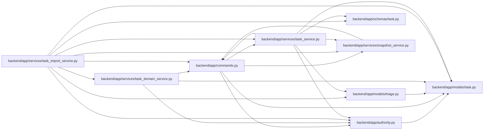

# task_import_service Module

**Path:** `backend/app/services/task_import_service.py`

## Description

Task and triage text imports share one authorized aggregate reservation, recovery point and transaction. Observed revisions are accepted additively for compatibility, with strict requirements controlled by server policy. Direct collaborator calls use the same transaction and revision guard.

Task text import, export, and triage intake workflows.

## Imports

| Source | Symbols |
|--------|---------|
| `app.authority` | `require_project` |
| `app.commands` | `atomic_command`, `commit_or_flush`, `lock_iterations` |
| `app.models.task` | `Task` |
| `app.models.triage` | `TriageItem`, `TriageItemStatus` |
| `app.schemas.task` | `TaskImportDestination` |
| `app.services.snapshot_service` | `SnapshotService` |
| `app.services.task_domain_service` | `nominal_day_hours` |
| `app.services.task_service` | `TaskService` |
| `json` | `json` |
| `sqlalchemy.ext.asyncio` | `AsyncSession` |
| `typing` | `Optional`, `TYPE_CHECKING` |

## Local dependency map

<!-- Auto-generated local dependency summary. Do not edit by hand. -->

### Internal neighbors

| Direction | Module |
|---|---|
| Outbound | [authority](../modules/authority.md) |
| Outbound | [commands](../modules/commands.md) |
| Outbound | [models_task](../modules/models_task.md) |
| Outbound | [models_triage](../modules/models_triage.md) |
| Outbound | [schemas_task](../modules/schemas_task.md) |
| Outbound | [snapshot_service](../modules/snapshot_service.md) |
| Outbound | [task_domain_service](../modules/task_domain_service.md) |
| Outbound | [task_service](../modules/task_service.md) |

### External packages

| Language | Used packages | Undeclared packages |
|---|---:|---:|
| python | 1 | 0 |

## Classes

| Class | Line | Bases | Description |
|-------|------|-------|-------------|
| [TaskImportService](../entities/TaskImportService.md) | 21 | — | Own task text parsing, assignee resolution, and import persistence. |
