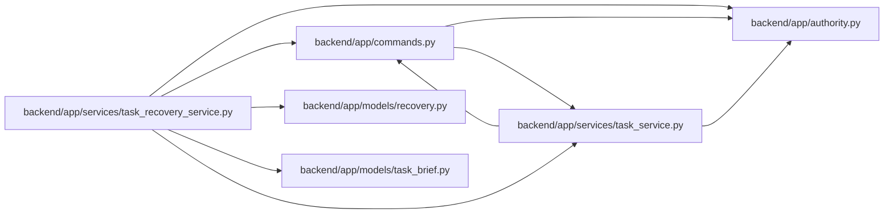

# task_recovery_service Module

**Path:** `backend/app/services/task_recovery_service.py`

## Description

Version allocation shared by scheduled and project-backlog recovery.

Scheduled and backlog restoration share a version allocator under the owning scope lock. It advances above the saved version, live task, retained history and durable deletion fence. Current progress and acceptance are cleared; immutable history survives. A deleted task without a reliable deletion fence returns snapshot_version_history_unknown (409), requiring recovery from a complete matching database backup.

## Imports

| Source | Symbols |
|--------|---------|
| `app.authority` | `AuthorityError`, `internal_authority` |
| `app.commands` | `current_command` |
| `app.models.recovery` | `TaskDeletionFence` |
| `app.models.task_brief` | `TaskBriefRevision`, `TaskProgressRecord`, `TaskReviewRecord` |
| `app.services.task_service` | `TaskService` |
| `sqlalchemy` | `func`, `select` |

## Local dependency map

<!-- Auto-generated local dependency summary. Do not edit by hand. -->

### Internal neighbors

| Direction | Module |
|---|---|
| Outbound | [authority](../modules/authority.md) |
| Outbound | [commands](../modules/commands.md) |
| Outbound | [recovery](../modules/recovery.md) |
| Outbound | [models_task_brief](../modules/models_task_brief.md) |
| Outbound | [task_service](../modules/task_service.md) |

### External packages

| Language | Used packages | Undeclared packages |
|---|---:|---:|
| python | 1 | 0 |

## Functions

| Function | Signature | Decorators | Description |
|----------|-----------|------------|-------------|
| `reserve_restored_task_version` | *(async)* `(db, task_id, task, saved_version)` | — | Restore strictly above every retained fence inside the scope's locked command. |