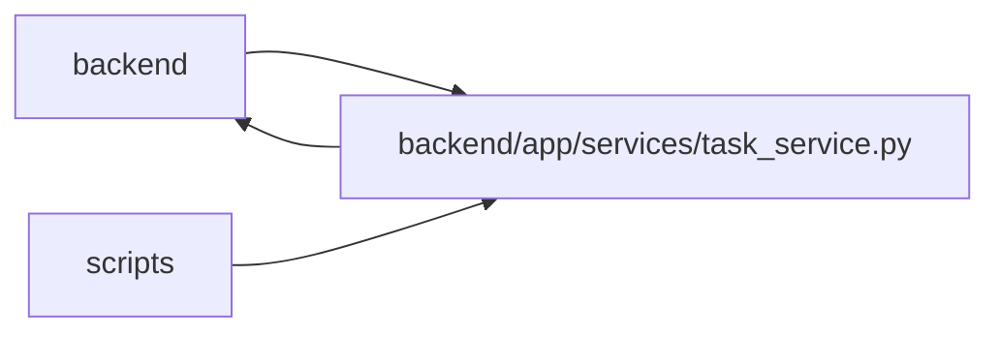

# task_service Module

**Path:** `backend/app/services/task_service.py`

## Description

Task service with business logic.

Task and aggregate versions fence edits and structural commands. Merge/unmerge reconcile old/new ancestors with leaf-only effort and lower-number-is-higher priority; claimed descendants require recovery. Pure rearrangement preserves valid accepted leaf evidence and effective optional/deferred meaning with audit, while content changes invalidate old acceptance. An empty summary remains structural rather than becoming invented leaf work.

Task commands share transaction ownership and task/iteration version fences. Unscheduled project work uses a project lock and transactional backlog recovery points. Human ownership survives schedule moves while capacity is cleared when the iteration changes. The complete graph loader remains authoritative for execution and structural mutation; bounded UI detail is a separate service. Public owner names are projected only through authorized task scope.

Backlog project changes require edit permission in both scopes. Project locks are acquired in ascending ID order and the task scope is rechecked before writing. The complete subtree must have no incoming or outgoing dependency across its boundary. Both backlogs receive transactional recovery points, descendants reserve one version per command, and rejected moves roll everything back. Actual dependency changes invalidate current progress and acceptance through general updates and individual add/remove commands. Immutable evidence history remains available, a command reserves one task version, and no-op dependency requests retain their current version. Locked graph relationships are loaded explicitly before applying a dependency update.

## Imports

| Source | Symbols |
|--------|---------|
| `app.authority` | `require_project`, `internal_authority` |
| `app.commands` | `atomic_command`, `command_transaction`, `commit_or_flush`, `lock_iterations`, `current_command`, `lock_planning` |
| `app.models.agent` | `TaskEvent` |
| `app.models.iteration` | `Iteration` |
| `app.models.project` | `Project`, `ProjectMilestone` |
| `app.models.request_source` | `RequestSourceLink` |
| `app.models.task` | `Task`, `TaskDependency`, `TaskStatus` |
| `app.models.team_member` | `TeamMember` |
| `app.models.triage` | `TriageItem` |
| `app.query_limits` | `CollectionLimitExceededError`, `MAX_ITERATION_TREE_TASKS` |
| `app.schemas.task` | `TaskAssignee`, `TaskClaimedBy`, `TaskCreate`, `TaskImportDestination`, `TaskMilestone`, `TaskProject`, `TaskResponse`, `TaskUpdate` |
| `app.services.agent_readiness` | `evaluate_agent_readiness` |
| `app.services.external_link_service` | `ExternalLinkService` |
| `app.services.language_service` | `automatic_child_status_reason`, `incomplete_dependency_message`, `resolve_runtime_ui_language`, `task_requires_schedule_message` |
| `app.services.outbound_webhook_service` | `emit_outbound_webhook_event` |
| `app.services.snapshot_service` | `SnapshotService` |
| `app.services.task_hierarchy_service` | `TaskHierarchyService`, `TaskTreeIntegrityError` |
| `datetime` | `date` |
| `json` | `json` |
| `sqlalchemy` | `and_`, `or_`, `select`, `update` |
| `sqlalchemy.ext.asyncio` | `AsyncSession` |
| `sqlalchemy.orm` | `attributes`, `selectinload` |
| `typing` | `Any`, `Optional`, `Sequence` |

## Local dependency map

<!-- Auto-generated local dependency summary. Do not edit by hand. -->

> Module-level dependencies exceed the generated-diagram limits, so the diagram and table below group them by top-level package. Counts report the number of module neighbors in each package.

### Internal neighbors

| Direction | Module |
|---|---|
| Inbound | `backend` (42) |
| Inbound | `scripts` (2) |
| Outbound | `backend` (17) |

### External packages

| Language | Used packages | Undeclared packages |
|---|---:|---:|
| python | 1 | 0 |

> All 60 module neighbor(s) are summarized by package because the module-level view exceeds the 12-node limit.

## Classes

| Class | Line | Bases | Description |
|-------|------|-------|-------------|
| [TaskVersionConflictError](../entities/TaskVersionConflictError.md) | 50 | `RuntimeError` | Raised when an optimistic task write no longer matches the stored version. |
| [TaskService](../entities/TaskService.md) | 71 | — | Service for task operations. |