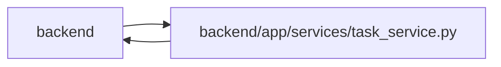

# task_service Module

**Path:** `backend/app/services/task_service.py`

## Description

Task service with business logic.

## Imports

| Source | Symbols |
|--------|---------|
| `app.models.agent` | `TaskEvent` |
| `app.models.iteration` | `Iteration` |
| `app.models.project` | `Project`, `ProjectMilestone` |
| `app.models.request_source` | `RequestSourceLink` |
| `app.models.task` | `Task`, `TaskDependency`, `TaskStatus` |
| `app.models.team_member` | `TeamMember` |
| `app.models.triage` | `TriageItem` |
| `app.query_limits` | `CollectionLimitExceededError`, `MAX_ITERATION_TREE_TASKS` |
| `app.schemas.task` | `TaskAssignee`, `TaskClaimedBy`, `TaskCreate`, `TaskImportDestination`, `TaskMilestone`, `TaskProject`, `TaskResponse`, `TaskUpdate` |
| `app.services.agent_readiness` | `evaluate_agent_readiness` |
| `app.services.external_link_service` | `ExternalLinkService` |
| `app.services.language_service` | `automatic_child_status_reason`, `incomplete_dependency_message`, `resolve_runtime_ui_language`, `task_requires_schedule_message` |
| `app.services.outbound_webhook_service` | `emit_outbound_webhook_event` |
| `app.services.snapshot_service` | `SnapshotService` |
| `datetime` | `date` |
| `json` | `json` |
| `sqlalchemy` | `select`, `update` |
| `sqlalchemy.ext.asyncio` | `AsyncSession` |
| `sqlalchemy.orm` | `attributes`, `selectinload` |
| `typing` | `Any`, `Optional`, `Sequence` |

## Local dependency map

<!-- Auto-generated local dependency summary. Do not edit by hand. -->

> Module-level dependencies exceed the generated-diagram limits, so the diagram and table below group them by top-level package. Counts report the number of module neighbors in each package.

### Internal neighbors

| Direction | Module |
|---|---|
| Inbound | `backend` (25) |
| Outbound | `backend` (14) |

### External packages

| Language | Used packages | Undeclared packages |
|---|---:|---:|
| python | 1 | 0 |

> All 39 module neighbor(s) are summarized by package because the module-level view exceeds the 12-node limit.

## Classes

| Class | Line | Bases | Description |
|-------|------|-------|-------------|
| [TaskTreeIntegrityError](../entities/TaskTreeIntegrityError.md) | 43 | `ValueError` | Raised when persisted task parent links cannot form a valid iteration tree. |
| [TaskVersionConflictError](../entities/TaskVersionConflictError.md) | 47 | `RuntimeError` | Raised when an optimistic task write no longer matches the stored version. |
| [TaskService](../entities/TaskService.md) | 68 | — | Service for task operations. |
