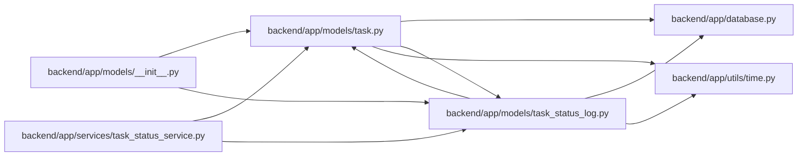

# task_status_log Module

**Path:** `backend/app/models/task_status_log.py`

## Description

Task status log model for audit trail.

## Imports

| Source | Symbols |
|--------|---------|
| `app.database` | `Base` |
| `app.models.task` | `Task` |
| `app.utils.time` | `UTCDateTime`, `utc_now` |
| `datetime` | `datetime` |
| `sqlalchemy` | `ForeignKey`, `Integer`, `String`, `Text` |
| `sqlalchemy.orm` | `Mapped`, `mapped_column`, `relationship` |
| `typing` | `TYPE_CHECKING`, `Optional` |

## Local dependency map

<!-- Auto-generated local dependency summary. Do not edit by hand. -->

### Internal neighbors

| Direction | Module |
|---|---|
| Inbound | [models___init__](../modules/models___init__.md) |
| Inbound | [models_task](../modules/models_task.md) |
| Inbound | [task_status_service](../modules/task_status_service.md) |
| Outbound | [app_database](../modules/app_database.md) |
| Outbound | [models_task](../modules/models_task.md) |
| Outbound | [time](../modules/time.md) |

### External packages

| Language | Used packages | Undeclared packages |
|---|---:|---:|
| python | 1 | 0 |

## Classes

| Class | Line | Bases | Description |
|-------|------|-------|-------------|
| [TaskStatusLog](../entities/task_status_log_TaskStatusLog.md) | 15 | `Base` | Audit log for task status changes. |
