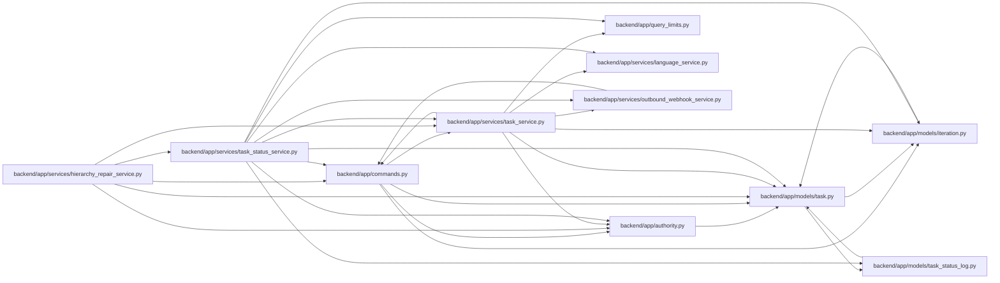

# task_status_service Module

**Path:** `backend/app/services/task_status_service.py`

## Description

Task status transitions, roll-up reconciliation, and status reporting.

Retains planned/active/resolved/closed transitions while separating actual UTC start/resolve/accept events from forecast dates and committed baselines. Acceptance requires review authority and is bound to the current task revision; automatic parent roll-up cannot fabricate independent leaf acceptance.

Direct lifecycle changes retain planned, active, resolved and closed values; summaries derive status from children. Human manual starts preserve forecast dates while recording actual UTC events. Independent acceptance is checked before closure. A review-authorized rejection returns work to active without attributing execution to the reviewer and requires fresh progress for subsequent acceptance.

## Imports

| Source | Symbols |
|--------|---------|
| `app.authority` | `AuthorityError` |
| `app.commands` | `atomic_command`, `command_transaction`, `commit_or_flush`, `lock_iterations` |
| `app.models.iteration` | `Iteration` |
| `app.models.task` | `Task`, `TaskDependency`, `TaskStatus` |
| `app.models.task_status_log` | `TaskStatusLog` |
| `app.query_limits` | `CollectionLimitExceededError`, `MAX_BOUNDED_LIST_ITEMS` |
| `app.services.language_service` | `automatic_child_status_reason`, `incomplete_dependency_message`, `resolve_runtime_ui_language`, `task_requires_schedule_message` |
| `app.services.outbound_webhook_service` | `OutboundWebhookService` |
| `app.services.task_service` | `TaskService` |
| `datetime` | `date`, `timedelta` |
| `json` | `json` |
| `sqlalchemy` | `desc`, `func`, `select` |
| `sqlalchemy.ext.asyncio` | `AsyncSession` |
| `sqlalchemy.orm` | `selectinload` |
| `typing` | `Any`, `Optional`, `Sequence`, `TYPE_CHECKING` |

## Local dependency map

<!-- Auto-generated local dependency summary. Do not edit by hand. -->

### Internal neighbors

| Direction | Module |
|---|---|
| Inbound | [hierarchy_repair_service](../modules/hierarchy_repair_service.md) |
| Outbound | [authority](../modules/authority.md) |
| Outbound | [commands](../modules/commands.md) |
| Outbound | [models_iteration](../modules/models_iteration.md) |
| Outbound | [models_task](../modules/models_task.md) |
| Outbound | [task_status_log](../modules/task_status_log.md) |
| Outbound | [query_limits](../modules/query_limits.md) |
| Outbound | [language_service](../modules/language_service.md) |
| Outbound | [outbound_webhook_service](../modules/outbound_webhook_service.md) |
| Outbound | [task_service](../modules/task_service.md) |

### External packages

| Language | Used packages | Undeclared packages |
|---|---:|---:|
| python | 1 | 0 |

## Classes

| Class | Line | Bases | Description |
|-------|------|-------|-------------|
| [TaskStatusService](../entities/TaskStatusService.md) | 30 | — | Own status transitions, dependent cascades, and parent reconciliation. |