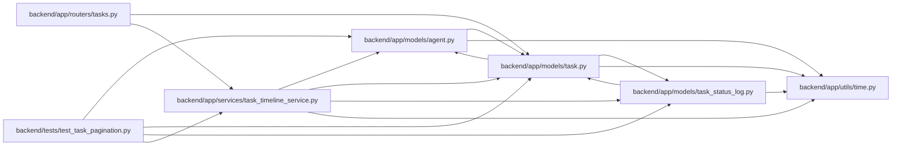

# task_timeline_service Module

**Path:** `backend/app/services/task_timeline_service.py`

## Description

Merged history is read in bounded per-source queries and sorted by timestamp, source and stable record ID. Opaque task-bound cursors are validated and every request rechecks task visibility. Run-event actor provenance comes from the owning run. The compatible timeline preserves chronological output and explicitly rejects overflow.

Bounded, permission-scoped keyset reads of the merged task timeline.

## Imports

| Source | Symbols |
|--------|---------|
| `app.models.agent` | `AgentRun`, `AgentRunEvent`, `TaskEvent` |
| `app.models.task` | `Task` |
| `app.models.task_status_log` | `TaskStatusLog` |
| `app.utils.time` | `as_utc` |
| `base64` | `base64` |
| `datetime` | `datetime` |
| `json` | `json` |
| `sqlalchemy` | `and_`, `or_`, `select` |
| `sqlalchemy.orm` | `selectinload` |

## Local dependency map

<!-- Auto-generated local dependency summary. Do not edit by hand. -->

### Internal neighbors

| Direction | Module |
|---|---|
| Inbound | [tasks](../modules/tasks.md) |
| Inbound | [test_task_pagination](../modules/test_task_pagination.md) |
| Outbound | [models_agent](../modules/models_agent.md) |
| Outbound | [models_task](../modules/models_task.md) |
| Outbound | [task_status_log](../modules/task_status_log.md) |
| Outbound | [time](../modules/time.md) |

### External packages

| Language | Used packages | Undeclared packages |
|---|---:|---:|
| python | 1 | 0 |

## Classes

| Class | Line | Bases | Description |
|-------|------|-------|-------------|
| [TaskTimelineService](../entities/TaskTimelineService.md) | 16 | — | — |
