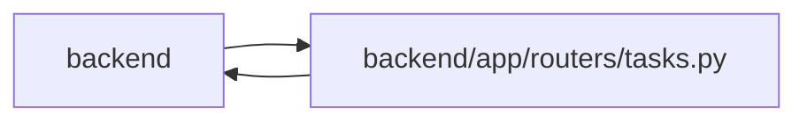

# tasks Module

**Path:** `backend/app/routers/tasks.py`

## Description

Task API router.

## Imports

| Source | Symbols |
|--------|---------|
| `app.commands` | `command_transaction`, `commit_or_flush`, `lock_iterations`, `current_command` |
| `app.database` | `get_db` |
| `app.models.task` | `Task` |
| `app.schemas.agent` | `TaskTimelineResponse`, `TaskTimelineItem` |
| `app.schemas.common` | `MessageResponse` |
| `app.schemas.external_link` | `ExternalLinkResponse`, `ExternalLinkUpdate`, `GitHubExternalLinkCreate`, `TaskExternalLinkCreate` |
| `app.schemas.task` | `TaskCreate`, `TaskUpdate`, `TaskResponse`, `TaskDependencyCreate`, `TaskReorder`, `TaskMerge`, `TaskUnmerge`, `TaskImportTriageItemResponse`, `TasksImportRequest`, `TasksImportResponse`, `TaskStatusChange`, `TaskStatusChangeResponse`, `TaskStatusLogResponse`, `CascadeUpdateInfo`, `TaskBulkOperationRequest`, `TaskBulkOperationResponse`, `TaskMoveRequest`, `TaskBatchUpdateRequest`, `TaskBatchUpdateResponse`, `TaskBatchUpdateResponseItem` |
| `app.schemas.team` | `AssigneeRecommendationResponse` |
| `app.services.agent_service` | `AgentService` |
| `app.services.assignee_recommendation_service` | `AssigneeRecommendationService` |
| `app.services.external_link_service` | `ExternalLinkConflictError`, `ExternalLinkService`, `ExternalLinkValidationError` |
| `app.services.github_status_service` | `GitHubStatusService` |
| `app.services.iteration_service` | `IterationService`, `IterationService` |
| `app.services.language_service` | `backend_error_message`, `entity_not_found_message`, `invalid_status_transition_message`, `resolve_runtime_ui_language` |
| `app.services.scheduler_service` | `SchedulerService` |
| `app.services.task_bulk_operation_service` | `TaskBulkOperationService` |
| `app.services.task_service` | `TaskService`, `TaskVersionConflictError` |
| `fastapi` | `APIRouter`, `Body`, `Depends`, `HTTPException`, `Response`, `status` |
| `json` | `json`, `json` |
| `logging` | `logging` |
| `pydantic` | `ValidationError` |
| `sqlalchemy` | `select` |
| `sqlalchemy.ext.asyncio` | `AsyncSession` |
| `typing` | `Annotated` |

## Local dependency map

<!-- Auto-generated local dependency summary. Do not edit by hand. -->

> Module-level dependencies exceed the generated-diagram limits, so the diagram and table below group them by top-level package. Counts report the number of module neighbors in each package.

### Internal neighbors

| Direction | Module |
|---|---|
| Inbound | `backend` (3) |
| Outbound | `backend` (17) |

### External packages

| Language | Used packages | Undeclared packages |
|---|---:|---:|
| python | 3 | 0 |

> All 20 module neighbor(s) are summarized by package because the module-level view exceeds the 12-node limit.

## Functions

| Function | Signature | Decorators | Description |
|----------|-----------|------------|-------------|
| `_raise_task_version_conflict` | `(exc: TaskVersionConflictError) -> None` | — | Raise the stable structured optimistic-concurrency response. |
| `_localized_detail` | *(async)* `(db: AsyncSession, message: str) -> str` | — | — |
| `_not_found_detail` | *(async)* `(db: AsyncSession, entity: str, entity_id: int) -> str` | — | — |
| `get_task_service` | *(async)* `(db: Annotated[AsyncSession, Depends(get_db, scope='function')]) -> TaskService` | — | Dependency for task service. |
| `get_external_link_service` | *(async)* `(db: Annotated[AsyncSession, Depends(get_db, scope='function')]) -> ExternalLinkService` | — | Dependency for external link service. |
| `get_github_status_service` | *(async)* `(db: Annotated[AsyncSession, Depends(get_db, scope='function')]) -> GitHubStatusService` | — | Dependency for GitHub status refresh service. |
| `get_assignee_recommendation_service` | *(async)* `(db: Annotated[AsyncSession, Depends(get_db, scope='function')]) -> AssigneeRecommendationService` | — | Dependency for assignee recommendation service. |
| `get_task_bulk_operation_service` | *(async)* `(db: Annotated[AsyncSession, Depends(get_db, scope='function')]) -> TaskBulkOperationService` | — | Dependency for selected-task bulk operation service. |
| `get_scheduler_service` | *(async)* `(db: Annotated[AsyncSession, Depends(get_db, scope='function')]) -> SchedulerService` | — | Dependency for scheduler service. |
| `get_tasks` | *(async)* `(iteration_id: int, service: Annotated[TaskService, Depends(get_task_service)], db: Annotated[AsyncSession, Depends(get_db, scope='function')])` | `@router.get('/iterations/{iteration_id}/tasks', response_model=list[TaskResponse])` | Get all tasks for an iteration (tree structure). |
| `create_task` | *(async)* `(iteration_id: int, data: TaskCreate, service: Annotated[TaskService, Depends(get_task_service)], db: Annotated[AsyncSession, Depends(get_db, scope='function')])` | `@router.post('/iterations/{iteration_id}/tasks', response_model=TaskResponse, status_code=status.HTTP_201_CREATED)` | Create a new task in an iteration. |
| `apply_batch_update_items` | *(async)* `(service: TaskService, iteration_id: int, iteration_end_date, items) -> tuple[list[TaskResponse], list[TaskBatchUpdateResponseItem]]` | — | Apply a list of TaskBatchUpdateItem changes without committing. |
| `batch_update_tasks` | *(async)* `(iteration_id: int, data: TaskBatchUpdateRequest, service: Annotated[TaskService, Depends(get_task_service)], scheduler_service: Annotated[SchedulerService, Depends(get_scheduler_service)], db: Annotated[AsyncSession, Depends(get_db, scope='function')])` | `@router.post('/iterations/{iteration_id}/tasks/batch-update', response_model=TaskBatchUpdateResponse)` | Batch update multiple tasks in a single iteration under transaction block. |
| `run_task_bulk_operation` | *(async)* `(data: TaskBulkOperationRequest, service: Annotated[TaskBulkOperationService, Depends(get_task_bulk_operation_service)])` | `@router.post('/tasks/bulk-operations', response_model=TaskBulkOperationResponse)` | Preview or apply one operation to a selected set of tasks. |
| `get_task` | *(async)* `(task_id: int, service: Annotated[TaskService, Depends(get_task_service)], db: Annotated[AsyncSession, Depends(get_db, scope='function')])` | `@router.get('/tasks/{task_id}', response_model=TaskResponse)` | Get task by ID. |
| `get_task_assignee_recommendations` | *(async)* `(task_id: int, service: Annotated[AssigneeRecommendationService, Depends(get_assignee_recommendation_service)])` | `@router.get('/tasks/{task_id}/assignee-recommendations', response_model=list[AssigneeRecommendationResponse])` | Return explainable assignee recommendations for a task. |
| `update_task` | *(async)* `(task_id: int, data: TaskUpdate, service: Annotated[TaskService, Depends(get_task_service)], db: Annotated[AsyncSession, Depends(get_db, scope='function')])` | `@router.put('/tasks/{task_id}', response_model=TaskResponse)` | Update a task. |
| `move_task` | *(async)* `(task_id: int, data: TaskMoveRequest, service: Annotated[TaskService, Depends(get_task_service)], db: Annotated[AsyncSession, Depends(get_db, scope='function')])` | `@router.post('/tasks/{task_id}/move', response_model=TaskResponse)` | Move a task subtree to a target iteration. |
| `delete_task` | *(async)* `(task_id: int, service: Annotated[TaskService, Depends(get_task_service)], expected_version: int \| None = None, expected_revision: int \| None = None)` | `@router.delete('/tasks/{task_id}', response_model=MessageResponse)` | Delete a task and its subtasks. |
| `list_task_external_links` | *(async)* `(task_id: int, task_service: Annotated[TaskService, Depends(get_task_service)], link_service: Annotated[ExternalLinkService, Depends(get_external_link_service)])` | `@router.get('/tasks/{task_id}/external-links', response_model=list[ExternalLinkResponse])` | List persisted and legacy external links for a task. |
| `create_task_external_link` | *(async)* `(task_id: int, raw_data: Annotated[dict, Body(...)], link_service: Annotated[ExternalLinkService, Depends(get_external_link_service)])` | `@router.post('/tasks/{task_id}/external-links', response_model=ExternalLinkResponse, status_code=status.HTTP_201_CREATED)` | Create a persisted external link for a task. |
| `create_task_github_external_link` | *(async)* `(task_id: int, raw_data: Annotated[dict, Body(...)], link_service: Annotated[ExternalLinkService, Depends(get_external_link_service)])` | `@router.post('/tasks/{task_id}/external-links/github', response_model=ExternalLinkResponse, status_code=status.HTTP_201_CREATED)` | Parse and create a manual GitHub link for a task. |
| `refresh_github_external_link` | *(async)* `(link_id: int, github_service: Annotated[GitHubStatusService, Depends(get_github_status_service)], link_service: Annotated[ExternalLinkService, Depends(get_external_link_service)])` | `@router.post('/external-links/{link_id}/refresh-github', response_model=ExternalLinkResponse)` | Refresh cached GitHub PR status metadata for one external link. |
| `update_external_link` | *(async)* `(link_id: int, raw_data: Annotated[dict, Body(...)], link_service: Annotated[ExternalLinkService, Depends(get_external_link_service)])` | `@router.put('/external-links/{link_id}', response_model=ExternalLinkResponse)` | Update a persisted external link. |
| `delete_external_link` | *(async)* `(link_id: int, link_service: Annotated[ExternalLinkService, Depends(get_external_link_service)])` | `@router.delete('/external-links/{link_id}', response_model=MessageResponse)` | Delete a persisted external link. |
| `create_subtask` | *(async)* `(task_id: int, data: TaskCreate, service: Annotated[TaskService, Depends(get_task_service)], db: Annotated[AsyncSession, Depends(get_db, scope='function')])` | `@router.post('/tasks/{task_id}/subtasks', response_model=TaskResponse, status_code=status.HTTP_201_CREATED)` | Create a subtask under a parent task. |
| `get_subtasks` | *(async)* `(task_id: int, service: Annotated[TaskService, Depends(get_task_service)], db: Annotated[AsyncSession, Depends(get_db, scope='function')])` | `@router.get('/tasks/{task_id}/subtasks', response_model=list[TaskResponse])` | Get subtasks of a task. |
| `add_dependency` | *(async)* `(task_id: int, data: TaskDependencyCreate, service: Annotated[TaskService, Depends(get_task_service)])` | `@router.post('/tasks/{task_id}/dependencies', response_model=MessageResponse)` | Add a dependency to a task. |
| `remove_dependency` | *(async)* `(task_id: int, depends_on_id: int, service: Annotated[TaskService, Depends(get_task_service)])` | `@router.delete('/tasks/{task_id}/dependencies/{depends_on_id}', response_model=MessageResponse)` | Remove a dependency from a task. |
| `reorder_tasks` | *(async)* `(data: TaskReorder, response: Response, service: Annotated[TaskService, Depends(get_task_service)])` | `@router.post('/tasks/reorder', response_model=MessageResponse)` | Reorder a list of tasks by updating their sort_order. |
| `merge_tasks` | *(async)* `(iteration_id: int, data: TaskMerge, service: Annotated[TaskService, Depends(get_task_service)], db: Annotated[AsyncSession, Depends(get_db, scope='function')])` | `@router.post('/iterations/{iteration_id}/tasks/merge', response_model=TaskResponse, status_code=status.HTTP_201_CREATED)` | Merge multiple leaf tasks under a new parent task. |
| `unmerge_task` | *(async)* `(task_id: int, data: TaskUnmerge, service: Annotated[TaskService, Depends(get_task_service)], db: Annotated[AsyncSession, Depends(get_db, scope='function')])` | `@router.post('/tasks/{task_id}/unmerge', response_model=list[TaskResponse], status_code=status.HTTP_200_OK)` | Promote all child tasks to top level and optionally delete the parent. |
| `import_tasks` | *(async)* `(iteration_id: int, data: TasksImportRequest, service: Annotated[TaskService, Depends(get_task_service)], db: Annotated[AsyncSession, Depends(get_db, scope='function')])` | `@router.post('/iterations/{iteration_id}/tasks/import', response_model=TasksImportResponse, status_code=status.HTTP_201_CREATED)` | Import tasks from text format. |
| `get_tasks_text` | *(async)* `(iteration_id: int, service: Annotated[TaskService, Depends(get_task_service)], db: Annotated[AsyncSession, Depends(get_db, scope='function')])` | `@router.get('/iterations/{iteration_id}/tasks/text', response_model=str)` | Get all tasks in text format for editing. |
| `bulk_update_tasks` | *(async)* `(iteration_id: int, data: TasksImportRequest, service: Annotated[TaskService, Depends(get_task_service)], db: Annotated[AsyncSession, Depends(get_db, scope='function')])` | `@router.post('/iterations/{iteration_id}/tasks/bulk-update', response_model=TasksImportResponse, status_code=status.HTTP_200_OK)` | Bulk update tasks from text format. |
| `change_task_status` | *(async)* `(task_id: int, data: TaskStatusChange, service: Annotated[TaskService, Depends(get_task_service)], db: Annotated[AsyncSession, Depends(get_db, scope='function')])` | `@router.put('/tasks/{task_id}/status', response_model=TaskStatusChangeResponse)` | Change task status with validation and side effects. |
| `get_task_status_history` | *(async)* `(task_id: int, service: Annotated[TaskService, Depends(get_task_service)])` | `@router.get('/tasks/{task_id}/status-history', response_model=list[TaskStatusLogResponse])` | Get status change history for a task. |
| `get_task_timeline` | *(async)* `(task_id: int, db: Annotated[AsyncSession, Depends(get_db, scope='function')])` | `@router.get('/tasks/{task_id}/timeline', response_model=TaskTimelineResponse)` | Get merged task timeline with events, status logs, and agent runs. |
| `get_iteration_status_history` | *(async)* `(iteration_id: int, service: Annotated[TaskService, Depends(get_task_service)], db: Annotated[AsyncSession, Depends(get_db, scope='function')])` | `@router.get('/iterations/{iteration_id}/history', response_model=list[TaskStatusLogResponse])` | Get recent status history for all tasks in an iteration. |
| `get_overdue_tasks` | *(async)* `(iteration_id: int, service: Annotated[TaskService, Depends(get_task_service)], db: Annotated[AsyncSession, Depends(get_db, scope='function')])` | `@router.get('/iterations/{iteration_id}/overdue', response_model=list[TaskResponse])` | Get all overdue tasks for an iteration. |
