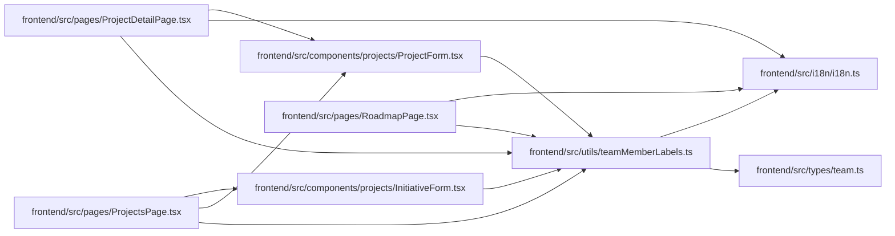

# teamMemberLabels Module

**Path:** `frontend/src/utils/teamMemberLabels.ts`

## Description

_Auto-generated from `frontend/src/utils/teamMemberLabels.ts`._

## Imports

| Source | Symbols |
|--------|---------|
| `../i18n/i18n` | `i18n` |
| `../types/team` | `TeamMemberOption`, `TeamMemberProfileCompact` |

## Module Signals

| Signal | Values |
|--------|--------|
| Exports | `formatOwnerLabel`, `formatPortfolioOwnerLabel`, `formatTeamMemberLabel`, `formatTeamMemberProfileLabel` |
| Constants | `t` |
| Module calls | `t = bind` |

## Local dependency map

<!-- Auto-generated local dependency summary. Do not edit by hand. -->

### Internal neighbors

| Direction | Module |
|---|---|
| Inbound | [InitiativeForm](../modules/InitiativeForm.md) |
| Inbound | [ProjectForm](../modules/ProjectForm.md) |
| Inbound | [ProjectDetailPage](../modules/ProjectDetailPage.md) |
| Inbound | [ProjectsPage](../modules/ProjectsPage.md) |
| Inbound | [RoadmapPage](../modules/RoadmapPage.md) |
| Outbound | [i18n](../modules/i18n.md) |
| Outbound | [types_team](../modules/types_team.md) |

## Classes

| Class | Kind | Line | Bases / Target | Description |
|-------|------|------|----------------|-------------|
| [TeamMemberLabelSource](../entities/TeamMemberLabelSource.md) | Type alias | 6 | — | — |
| [TeamMemberProfileLabelSource](../entities/TeamMemberProfileLabelSource.md) | Type alias | 7 | — | — |

## Functions

| Function | Signature | Decorators | Description |
|----------|-----------|------------|-------------|
| `formatTeamMemberLabel` | `(member: TeamMemberLabelSource)` | — | — |
| `formatOwnerLabel` | `(owner: TeamMemberLabelSource \| null, ownerId: number \| null, emptyLabel: string)` | — | — |
| `formatTeamMemberProfileLabel` | `(profile: TeamMemberProfileLabelSource)` | — | — |
| `formatPortfolioOwnerLabel` | `(ownerProfile: TeamMemberProfileLabelSource \| null, legacyOwner: TeamMemberLabelSource \| null, legacyOwnerId: number \| null, emptyLabel: string)` | — | — |
