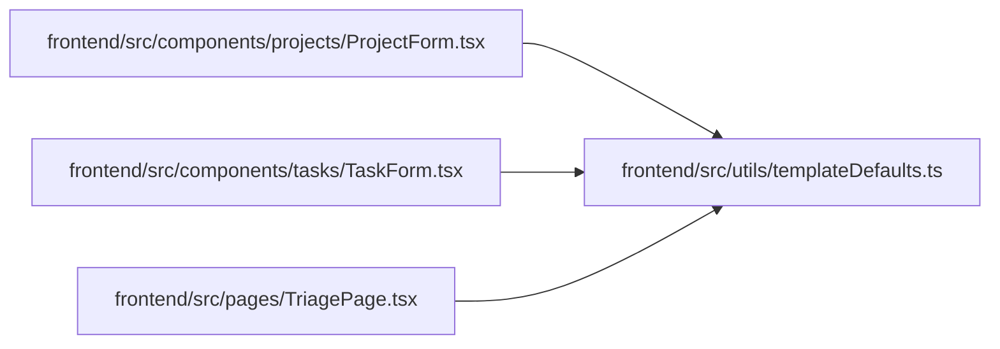

# templateDefaults Module

**Path:** `frontend/src/utils/templateDefaults.ts`

## Description

_Auto-generated from `frontend/src/utils/templateDefaults.ts`._

## Module Signals

| Signal | Values |
|--------|--------|
| Exports | `appendChecklistToDescription`, `getPayloadBoolean`, `getPayloadNumber`, `getPayloadString`, `mergeLabels` |

## Local dependency map

<!-- Auto-generated local dependency summary. Do not edit by hand. -->

### Internal neighbors

| Direction | Module |
|---|---|
| Inbound | [ProjectForm](../modules/ProjectForm.md) |
| Inbound | [TaskForm](../modules/TaskForm.md) |
| Inbound | [TriagePage](../modules/TriagePage.md) |

## Functions

| Function | Signature | Decorators | Description |
|----------|-----------|------------|-------------|
| `mergeLabels` | `(current: string[] = [], incoming: string[] = [])` | — | — |
| `appendChecklistToDescription` | `(description: string \| null \| undefined, checklist: string[] = [])` | — | — |
| `getPayloadString` | `(payload: Record<string, unknown>, key: string, fallback: string \| null = null)` | — | — |
| `getPayloadBoolean` | `(payload: Record<string, unknown>, key: string, fallback: boolean)` | — | — |
| `getPayloadNumber` | `(payload: Record<string, unknown>, key: string, fallback: number)` | — | — |
