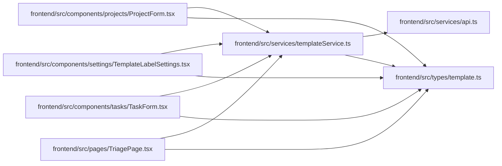

# templateService Module

**Path:** `frontend/src/services/templateService.ts`

## Description

_Auto-generated from `frontend/src/services/templateService.ts`._

## Imports

| Source | Symbols |
|--------|---------|
| `../types/template` | `TemplateListParams`, `WorkTemplate`, `WorkTemplateCreate`, `WorkTemplateUpdate` |
| `./api` | `api` |

## Module Signals

| Signal | Values |
|--------|--------|
| Exports | `FrontendTemplateService`, `templateService` |
| Constants | `templateService` |

## Local dependency map

<!-- Auto-generated local dependency summary. Do not edit by hand. -->

### Internal neighbors

| Direction | Module |
|---|---|
| Inbound | [ProjectForm](../modules/ProjectForm.md) |
| Inbound | [TemplateLabelSettings](../modules/TemplateLabelSettings.md) |
| Inbound | [TaskForm](../modules/TaskForm.md) |
| Inbound | [TriagePage](../modules/TriagePage.md) |
| Outbound | [api](../modules/api.md) |
| Outbound | [types_template](../modules/types_template.md) |

## Classes

| Class | Kind | Line | Bases / Target | Description |
|-------|------|------|----------------|-------------|
| [FrontendTemplateService](../entities/FrontendTemplateService.md) | Class | 23 | — | — |
