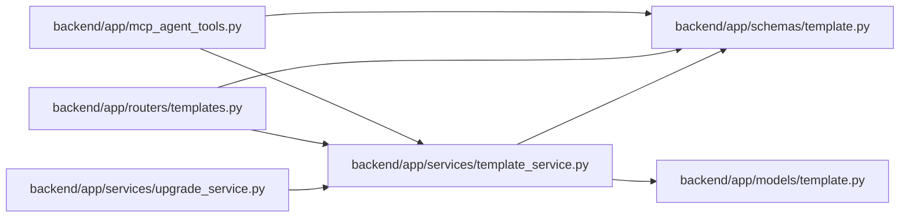

# template_service Module

**Path:** `backend/app/services/template_service.py`

## Description

Service for reusable work templates and built-in defaults.

## Imports

| Source | Symbols |
|--------|---------|
| `app.models.template` | `TemplateType`, `WorkTemplate` |
| `app.schemas.template` | `WorkTemplateCreate`, `WorkTemplateUpdate` |
| `sqlalchemy` | `Select`, `select` |
| `sqlalchemy.ext.asyncio` | `AsyncSession` |
| `typing` | `Any`, `Optional`, `Sequence` |

## Local dependency map

<!-- Auto-generated local dependency summary. Do not edit by hand. -->

### Internal neighbors

| Direction | Module |
|---|---|
| Inbound | [mcp_agent_tools](../modules/mcp_agent_tools.md) |
| Inbound | [templates](../modules/templates.md) |
| Inbound | [upgrade_service](../modules/upgrade_service.md) |
| Outbound | [models_template](../modules/models_template.md) |
| Outbound | [schemas_template](../modules/schemas_template.md) |

### External packages

| Language | Used packages | Undeclared packages |
|---|---:|---:|
| python | 1 | 0 |

## Classes

| Class | Line | Bases | Description |
|-------|------|-------|-------------|
| [TemplateService](../entities/TemplateService.md) | 157 | — | Service for template CRUD and built-in template seeding. |
