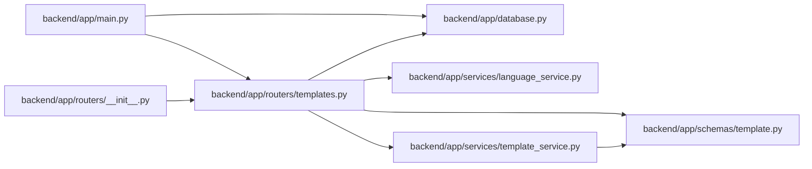

# templates Module

**Path:** `backend/app/routers/templates.py`

## Description

Template API router.

## Imports

| Source | Symbols |
|--------|---------|
| `app.database` | `get_db` |
| `app.schemas.template` | `TemplateType`, `WorkTemplateCreate`, `WorkTemplateResponse`, `WorkTemplateUpdate` |
| `app.services.language_service` | `entity_not_found_message`, `resolve_runtime_ui_language` |
| `app.services.template_service` | `TemplateService` |
| `fastapi` | `APIRouter`, `Depends`, `HTTPException`, `Query`, `status` |
| `sqlalchemy.ext.asyncio` | `AsyncSession` |
| `typing` | `Annotated`, `Optional` |

## Local dependency map

<!-- Auto-generated local dependency summary. Do not edit by hand. -->

### Internal neighbors

| Direction | Module |
|---|---|
| Inbound | [app_main](../modules/app_main.md) |
| Inbound | [routers___init__](../modules/routers___init__.md) |
| Outbound | [app_database](../modules/app_database.md) |
| Outbound | [schemas_template](../modules/schemas_template.md) |
| Outbound | [language_service](../modules/language_service.md) |
| Outbound | [template_service](../modules/template_service.md) |

### External packages

| Language | Used packages | Undeclared packages |
|---|---:|---:|
| python | 2 | 0 |

## Functions

| Function | Signature | Decorators | Description |
|----------|-----------|------------|-------------|
| `get_template_service` | *(async)* `(db: Annotated[AsyncSession, Depends(get_db, scope='function')]) -> TemplateService` | — | Dependency for template service. |
| `list_templates` | *(async)* `(service: Annotated[TemplateService, Depends(get_template_service)], template_type: Annotated[Optional[TemplateType], Query()] = None, include_inactive: bool = Query(False))` | `@router.get('/templates', response_model=list[WorkTemplateResponse])` | List reusable templates. |
| `create_template` | *(async)* `(data: WorkTemplateCreate, service: Annotated[TemplateService, Depends(get_template_service)])` | `@router.post('/templates', response_model=WorkTemplateResponse, status_code=status.HTTP_201_CREATED)` | Create a reusable template. |
| `get_template` | *(async)* `(template_id: int, service: Annotated[TemplateService, Depends(get_template_service)])` | `@router.get('/templates/{template_id}', response_model=WorkTemplateResponse)` | Get a template by ID. |
| `update_template` | *(async)* `(template_id: int, data: WorkTemplateUpdate, service: Annotated[TemplateService, Depends(get_template_service)])` | `@router.put('/templates/{template_id}', response_model=WorkTemplateResponse)` | Update a reusable template. |
