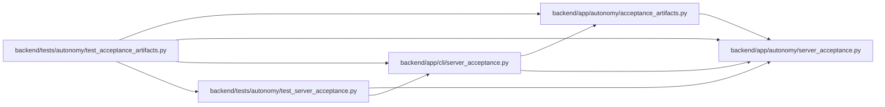

# test_acceptance_artifacts Module

**Path:** `backend/tests/autonomy/test_acceptance_artifacts.py`

## Description

Public exports retain exact signed bytes and reject secret or failed evidence.

## Imports

| Source | Symbols |
|--------|---------|
| `app.autonomy.acceptance_artifacts` | `export_artifacts`, `verify_exported_artifacts`, `MAX_PREVIOUS_RECEIPTS` |
| `app.autonomy.server_acceptance` | `build_blocked_result`, `ServerAcceptanceError` |
| `app.cli.server_acceptance` | `main` |
| `json` | `json` |
| `os` | `os` |
| `pathlib` | `Path` |
| `pytest` | `pytest` |
| `shutil` | `shutil` |
| `subprocess` | `subprocess` |
| `sys` | `sys` |
| `tests.autonomy.test_server_acceptance` | `_receipt`, `_build_identity`, `PUBLIC_KEY_BASE64` |

## Local dependency map

<!-- Auto-generated local dependency summary. Do not edit by hand. -->

### Internal neighbors

| Direction | Module |
|---|---|
| Outbound | [acceptance_artifacts](../modules/acceptance_artifacts.md) |
| Outbound | [autonomy_server_acceptance](../modules/autonomy_server_acceptance.md) |
| Outbound | [cli_server_acceptance](../modules/cli_server_acceptance.md) |
| Outbound | [test_server_acceptance](../modules/test_server_acceptance.md) |

### External packages

| Language | Used packages | Undeclared packages |
|---|---:|---:|
| python | 1 | 1 |

## Functions

| Function | Signature | Decorators | Description |
|----------|-----------|------------|-------------|
| `_reports` | `(tmp_path)` | — | — |
| `test_archive_roundtrip_uses_exact_bytes_and_independent_trust` | `(tmp_path, monkeypatch, capsys)` | — | — |
| `test_allowlist_does_not_export_secret_named_files_or_unknown_receipt_fields` | `(tmp_path)` | — | — |
| `test_invalid_receipt_or_public_pin_is_failure_evidence_only` | `(tmp_path, fault)` | `@pytest.mark.parametrize('fault', ['missing-pin', 'wrong-pin', 'symlink', 'fifo', 'oversized', 'malformed', 'deep-json', 'changed-signature'])` | — |
| `test_controlled_failure_keeps_valid_history_but_never_claims_acceptance` | `(tmp_path)` | — | — |
| `test_downloaded_archive_tampering_cannot_verify` | `(tmp_path, fault)` | `@pytest.mark.parametrize('fault', ['bytes', 'candidate-index', 'independent-pin', 'missing-receipt', 'extra-file'])` | — |
| `test_retained_history_is_bounded_and_pins_are_associated` | `(tmp_path)` | — | — |
| `test_duplicate_json_keys_cannot_smuggle_unvalidated_bytes` | `(tmp_path)` | — | — |
| `test_dependency_failure_exports_only_sanitized_summary` | `(tmp_path)` | — | — |
| `test_blocked_history_keeps_export_and_verifier_failure_semantics_consistent` | `(tmp_path)` | — | — |
