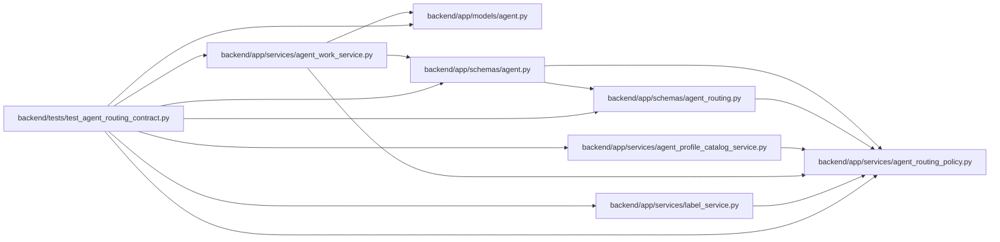

# test_agent_routing_contract Module

**Path:** `backend/tests/test_agent_routing_contract.py`

## Description

Focused contract tests for model-aware routing vocabulary and compatibility.

## Imports

| Source | Symbols |
|--------|---------|
| `__future__` | `annotations` |
| `app.models.agent` | `AgentActor`, `TaskRoutingAssessment` |
| `app.schemas.agent` | `MAX_AGENT_JSON_BYTES`, `AgentTaskAssignmentCreate` |
| `app.schemas.agent_routing` | `MAX_ROUTING_JSON_BYTES`, `MAX_ROUTING_TAGS`, `AgentModelBindingCreate`, `AgentModelCatalogCreate`, `TaskRoutingAssessmentCreate`, `TaskRoutingAssessmentResponse` |
| `app.services.agent_profile_catalog_service` | `AgentProfileCatalogService`, `CAPABILITY_SKILLS` |
| `app.services.agent_routing_policy` | `ASSESSMENT_REASON_CODES`, `CAPABILITY_LABEL_SKILL_KEYS`, `COST_TIER_ORDER`, `LATENCY_TIER_ORDER`, `MAX_ROUTING_PACKET_BYTES`, `MAX_ROUTING_SNAPSHOT_BYTES`, `AssessmentReasonCode`, `AssignmentIntent`, `ContextTier`, `CostTier`, `DifficultyAxis`, `DifficultyBand`, `LatencyTier`, `ROUTING_POLICY_VERSION`, `ROUTING_SKILL_KEYS`, `ReasoningTier`, `ReviewMode`, `RoutingBlockerCode`, `RoutingProfileEvidence`, `assignment_intent`, `canonical_routing_json_bytes`, `context_tier_meets`, `derive_difficulty_band`, `evaluate_actor_authorization`, `evaluate_assignment_compatibility`, `minimum_review_mode`, `routing_skills_for_capability_labels`, `validate_routing_packet_size` |
| `app.services.agent_work_service` | `AgentWorkService` |
| `app.services.label_service` | `CAPABILITY_LABEL_DESCRIPTIONS` |
| `collections` | `UserDict` |
| `copy` | `deepcopy` |
| `datetime` | `UTC`, `datetime` |
| `json` | `json` |
| `pydantic` | `ValidationError` |
| `pytest` | `pytest` |
| `types` | `MappingProxyType` |

## Local dependency map

<!-- Auto-generated local dependency summary. Do not edit by hand. -->

### Internal neighbors

| Direction | Module |
|---|---|
| Outbound | [models_agent](../modules/models_agent.md) |
| Outbound | [schemas_agent](../modules/schemas_agent.md) |
| Outbound | [agent_routing](../modules/agent_routing.md) |
| Outbound | [agent_profile_catalog_service](../modules/agent_profile_catalog_service.md) |
| Outbound | [agent_routing_policy](../modules/agent_routing_policy.md) |
| Outbound | [agent_work_service](../modules/agent_work_service.md) |
| Outbound | [label_service](../modules/label_service.md) |

### External packages

| Language | Used packages | Undeclared packages |
|---|---:|---:|
| python | 2 | 1 |

## Functions

| Function | Signature | Decorators | Description |
|----------|-----------|------------|-------------|
| `_catalog_payload` | `(**overrides)` | — | — |
| `_assessment_payload` | `(*, axes: dict[str, int] \| None = None, reason_codes: list[str] \| None = None, **overrides)` | — | — |
| `_profile` | `(*, profile_id: int = 10, profile_kind: str = 'agent', automation_enabled: bool = True, assignment_modes: frozenset[str] = frozenset({'execution'}), skill_levels: dict[str, int] \| None = None, weakness_keys: frozenset[str] = frozenset()) -> RoutingProfileEvidence` | — | — |
| `test_every_reasoning_tier_is_accepted` | `(tier: ReasoningTier) -> None` | `@pytest.mark.contract`, `@pytest.mark.parametrize('tier', list(ReasoningTier))` | — |
| `test_every_context_tier_is_accepted` | `(tier: ContextTier) -> None` | `@pytest.mark.contract`, `@pytest.mark.parametrize('tier', list(ContextTier))` | — |
| `test_every_cost_tier_is_accepted` | `(tier: CostTier) -> None` | `@pytest.mark.contract`, `@pytest.mark.parametrize('tier', list(CostTier))` | — |
| `test_every_latency_tier_is_accepted` | `(tier: LatencyTier) -> None` | `@pytest.mark.contract`, `@pytest.mark.parametrize('tier', list(LatencyTier))` | — |
| `test_every_review_mode_is_accepted_when_it_meets_policy` | `(review_mode: ReviewMode) -> None` | `@pytest.mark.contract`, `@pytest.mark.parametrize('review_mode', list(ReviewMode))` | — |
| `test_unknown_closed_vocabulary_values_fail_validation` | `() -> None` | `@pytest.mark.contract` | — |
| `test_every_governed_reason_code_is_accepted` | `(reason_code: str, expected_review: str) -> None` | `@pytest.mark.contract`, `@pytest.mark.parametrize(('reason_code', 'expected_review'), EXPECTED_REASON_REVIEW_FLOORS.items())` | — |
| `test_unknown_reason_and_skill_keys_fail_closed` | `() -> None` | `@pytest.mark.contract` | — |
| `test_malformed_reason_codes_are_normal_validation_failures` | `(reason_codes: object) -> None` | `@pytest.mark.contract`, `@pytest.mark.parametrize('reason_codes', ([1], [None], [b'security'], [object()], b'security', ('migration', 'data-integrity')))` | — |
| `test_mapping_wrappers_cannot_bypass_closed_skill_validation` | `(required_skill_levels: object) -> None` | `@pytest.mark.contract`, `@pytest.mark.parametrize('required_skill_levels', (MappingProxyType({'invented-skill': 3}), UserDict({'invented-skill': 3})))` | — |
| `test_normalized_duplicates_fail_closed` | `() -> None` | `@pytest.mark.contract` | — |
| `test_tag_list_and_confidence_bounds_fail_closed` | `() -> None` | `@pytest.mark.contract` | — |
| `test_difficulty_band_is_derived_without_averaging` | `() -> None` | `@pytest.mark.contract` | — |
| `test_high_risk_and_reason_rules_raise_review_floor` | `() -> None` | `@pytest.mark.contract` | — |
| `test_context_tier_ordering_matrix` | `(actual: ContextTier, minimum: ContextTier) -> None` | `@pytest.mark.contract`, `@pytest.mark.parametrize('actual', list(ContextTier))`, `@pytest.mark.parametrize('minimum', list(ContextTier))` | — |
| `test_cost_and_latency_tier_orders_are_explicit` | `() -> None` | `@pytest.mark.contract` | — |
| `test_canonical_normalization_is_byte_stable_across_boundaries` | `() -> None` | `@pytest.mark.contract` | — |
| `test_original_v1_assessment_rows_remain_readable` | `() -> None` | `@pytest.mark.contract` | — |
| `test_routing_packets_share_the_agent_snapshot_byte_limit` | `() -> None` | `@pytest.mark.contract` | — |
| `test_supervised_assignment_cannot_author_server_routing_snapshots` | `(schema_version: str) -> None` | `@pytest.mark.contract`, `@pytest.mark.parametrize('schema_version', ('routing-decision-snapshot-v1', 'routing-lineage-snapshot-v1'))` | — |
| `test_supervised_snapshot_handles_non_string_schema_version` | `(schema_version: object) -> None` | `@pytest.mark.contract`, `@pytest.mark.parametrize('schema_version', ([], {}))` | — |
| `test_routing_snapshot_rejects_non_json_native_evidence` | `(snapshot: dict[object, object]) -> None` | `@pytest.mark.contract`, `@pytest.mark.parametrize('snapshot', ({'nested': {'unstable'}}, {'nested': object()}, {'nested': (1, 2)}, {'nested': {1: 'integer-key'}}, {'nested': float('nan')}))` | — |
| `test_at_limit_routing_snapshot_uses_the_validated_persistence_encoding` | `() -> None` | `@pytest.mark.contract` | — |
| `test_capability_labels_only_expose_explicit_skill_choices` | `() -> None` | `@pytest.mark.contract` | — |
| `test_assignment_intent_table_is_closed` | `(purpose: str, queue_class: str, intent: str) -> None` | `@pytest.mark.contract`, `@pytest.mark.parametrize(('purpose', 'queue_class', 'intent'), [('execution', 'normal', 'execution'), ('execution', 'rework', 'rework'), ('execution', 'recovery', 'recovery'), ('verification', 'normal', 'verification')])` | — |
| `test_verification_rejects_execution_only_queue_classes` | `(queue_class: str) -> None` | `@pytest.mark.contract`, `@pytest.mark.parametrize('queue_class', ['rework', 'recovery'])` | — |
| `test_actor_authorization_decision_table` | `(intent: str, enabled: bool, role: str, scopes: set[str], expected: tuple[str, ...]) -> None` | `@pytest.mark.contract`, `@pytest.mark.parametrize(('intent', 'enabled', 'role', 'scopes', 'expected'), [('execution', True, 'worker', {'work:execute'}, ()), ('rework', True, 'pm', {'work:execute'}, ()), ('recovery', True, 'worker', {'admin'}, ()), ('verification', True, 'verifier', {'verification:write'}, ()), ('execution', False, 'worker', {'work:execute'}, ('actor_disabled',)), ('execution', True, 'verifier', {'work:execute'}, ('actor_role_incompatible',)), ('verification', True, 'verifier', {'tasks:read'}, ('actor_scope_missing',))])` | — |
| `test_execution_intents_share_capacity_profile_rules` | `(intent: str) -> None` | `@pytest.mark.contract`, `@pytest.mark.parametrize('intent', [AssignmentIntent.EXECUTION.value, AssignmentIntent.REWORK.value, AssignmentIntent.RECOVERY.value])` | — |
| `test_profile_and_capacity_compatibility_blockers` | `(profile: RoutingProfileEvidence \| None, owner_id: int \| None, owner_profile_id: int \| None, expected: str) -> None` | `@pytest.mark.contract`, `@pytest.mark.parametrize(('profile', 'owner_id', 'owner_profile_id', 'expected'), [(None, 5, 11, 'actor_profile_missing'), (_profile(profile_kind='human'), 5, 10, 'profile_kind_human'), (_profile(profile_kind='hybrid', automation_enabled=False), 5, 10, 'profile_automation_disabled'), (_profile(profile_kind='hybrid', assignment_modes=frozenset()), 5, 10, 'profile_assignment_mode_missing'), (_profile(), None, None, 'capacity_owner_missing'), (_profile(), 5, None, 'capacity_owner_profile_missing'), (_profile(profile_id=10), 5, 12, 'actor_capacity_profile_mismatch')])` | — |
| `test_hybrid_profile_requires_explicit_automation_and_mode` | `() -> None` | `@pytest.mark.contract` | — |
| `test_verifier_must_be_actor_and_profile_independent` | `() -> None` | `@pytest.mark.contract` | — |
| `test_verifier_independence_requires_complete_paired_execution_evidence` | `(execution_actor_ids: list[int \| None], execution_profile_ids: list[int \| None]) -> None` | `@pytest.mark.contract`, `@pytest.mark.parametrize(('execution_actor_ids', 'execution_profile_ids'), [([7, 8], [20]), ([7], [20, 21]), ([7, None], [20, 21]), ([7, 8], [20, None])])` | — |
| `test_verifier_independence_accepts_complete_multi_execution_evidence` | `() -> None` | `@pytest.mark.contract` | — |
| `test_specialist_verification_requires_nonweak_skill_level` | `() -> None` | `@pytest.mark.contract` | — |
| `test_compatibility_evidence_cannot_bypass_authorization` | `() -> None` | `@pytest.mark.contract` | — |
| `test_assignment_service_consumes_the_separate_authority_contract` | `() -> None` | `@pytest.mark.contract` | — |
| `test_contract_collections_are_closed_and_duplicate_free` | `() -> None` | `@pytest.mark.contract` | — |
