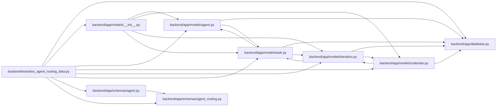

# test_agent_routing_data Module

**Path:** `backend/tests/test_agent_routing_data.py`

## Description

Focused model and schema coverage for MAR-DATA-001 and MAR-DATA-002.

## Imports

| Source | Symbols |
|--------|---------|
| `__future__` | `annotations` |
| `app` | `models` |
| `app.database` | `Base` |
| `app.models.agent` | `AgentActor`, `AgentModelBinding`, `AgentModelCatalogEntry`, `AgentRun`, `AgentTaskAssignment`, `ImmutableRoutingAssessmentError`, `TaskRoutingAssessment` |
| `app.models.calendar` | `Calendar` |
| `app.models.iteration` | `Iteration` |
| `app.models.task` | `Task` |
| `app.schemas.agent` | `AgentRunResponse`, `AgentTaskAssignmentResponse` |
| `app.schemas.agent_routing` | `AgentModelBindingCreate`, `AgentModelBindingResponse`, `AgentModelCatalogCreate`, `AgentModelCatalogResponse`, `TaskRoutingAssessmentCreate`, `TaskRoutingAssessmentResponse` |
| `datetime` | `UTC`, `date`, `datetime` |
| `pydantic` | `ValidationError` |
| `pytest` | `pytest` |
| `sqlalchemy` | `create_engine`, `event`, `select` |
| `sqlalchemy.exc` | `IntegrityError` |
| `sqlalchemy.orm` | `Session`, `selectinload` |

## Local dependency map

<!-- Auto-generated local dependency summary. Do not edit by hand. -->

### Internal neighbors

| Direction | Module |
|---|---|
| Outbound | [app_database](../modules/app_database.md) |
| Outbound | [models___init__](../modules/models___init__.md) |
| Outbound | [models_agent](../modules/models_agent.md) |
| Outbound | [models_calendar](../modules/models_calendar.md) |
| Outbound | [models_iteration](../modules/models_iteration.md) |
| Outbound | [models_task](../modules/models_task.md) |
| Outbound | [schemas_agent](../modules/schemas_agent.md) |
| Outbound | [agent_routing](../modules/agent_routing.md) |

### External packages

| Language | Used packages | Undeclared packages |
|---|---:|---:|
| python | 3 | 1 |

## Functions

| Function | Signature | Decorators | Description |
|----------|-----------|------------|-------------|
| `_catalog_values` | `(*, key: str = 'balanced-code', **overrides)` | — | — |
| `_assessment_payload` | `(*, task_id: int, task_version: int = 1, **overrides)` | — | — |
| `routing_session` | `(tmp_path)` | `@pytest.fixture` | — |
| `_persist_task_graph` | `(db_session: Session)` | — | — |
| `test_catalog_and_binding_schemas_are_secret_free_and_deterministic` | `() -> None` | `@pytest.mark.contract` | — |
| `test_assessment_schema_rejects_unsafe_band_and_unbounded_values` | `() -> None` | `@pytest.mark.contract` | — |
| `test_legacy_assignment_and_run_responses_remain_readable` | `() -> None` | `@pytest.mark.contract` | — |
| `test_multiple_bindings_allow_only_one_enabled_default` | `(routing_session) -> None` | `@pytest.mark.sqlite` | — |
| `test_catalog_database_constraints_fail_closed` | `(routing_session, overrides) -> None` | `@pytest.mark.sqlite`, `@pytest.mark.parametrize('overrides', [{'key': 'invalid-tier', 'reasoning_tier': 4}, {'key': 'Not-Canonical'}])` | — |
| `test_duplicate_catalog_keys_fail_at_database_boundary` | `(routing_session) -> None` | `@pytest.mark.sqlite` | — |
| `test_referenced_binding_cannot_be_deleted_and_can_be_disabled` | `(routing_session) -> None` | `@pytest.mark.sqlite` | — |
| `test_assessment_round_trip_staleness_and_immutability` | `(routing_session) -> None` | `@pytest.mark.sqlite` | — |
| `test_binding_schema_round_trip_exposes_selection_state` | `(routing_session) -> None` | `@pytest.mark.sqlite` | — |
