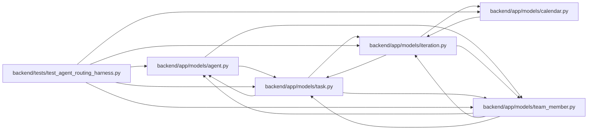

# test_agent_routing_harness Module

**Path:** `backend/tests/test_agent_routing_harness.py`

## Description

Smoke tests for the isolated routing database harness.

## Imports

| Source | Symbols |
|--------|---------|
| `__future__` | `annotations` |
| `app.models.agent` | `AgentActor` |
| `app.models.calendar` | `Calendar` |
| `app.models.iteration` | `Iteration` |
| `app.models.task` | `Task` |
| `app.models.team_member` | `TeamMember`, `TeamMemberProfile` |
| `collections.abc` | `Awaitable`, `Callable` |
| `pytest` | `pytest` |
| `socket` | `socket` |
| `sqlalchemy` | `func`, `select`, `text` |
| `sqlalchemy.ext.asyncio` | `AsyncSession` |
| `typing` | `Any` |

## Local dependency map

<!-- Auto-generated local dependency summary. Do not edit by hand. -->

### Internal neighbors

| Direction | Module |
|---|---|
| Outbound | [models_agent](../modules/models_agent.md) |
| Outbound | [models_calendar](../modules/models_calendar.md) |
| Outbound | [models_iteration](../modules/models_iteration.md) |
| Outbound | [models_task](../modules/models_task.md) |
| Outbound | [team_member](../modules/team_member.md) |

### External packages

| Language | Used packages | Undeclared packages |
|---|---:|---:|
| python | 2 | 1 |

## Functions

| Function | Signature | Decorators | Description |
|----------|-----------|------------|-------------|
| `_build_routing_graph` | *(async)* `(*, profile_factory: Factory, actor_factory: Factory, team_member_factory: Factory, task_factory: Factory) -> tuple[TeamMemberProfile, AgentActor, TeamMember, Task]` | — | — |
| `test_routing_factories_build_an_isolated_foreign_key_graph` | *(async)* `(isolated_case: int, db_session: AsyncSession, profile_factory: Factory, actor_factory: Factory, team_member_factory: Factory, task_factory: Factory) -> None` | `@pytest.mark.contract`, `@pytest.mark.sqlite`, `@pytest.mark.parametrize('isolated_case', (1, 2))` | — |
| `test_routing_harness_blocks_unapproved_network` | `() -> None` | `@pytest.mark.contract` | — |
