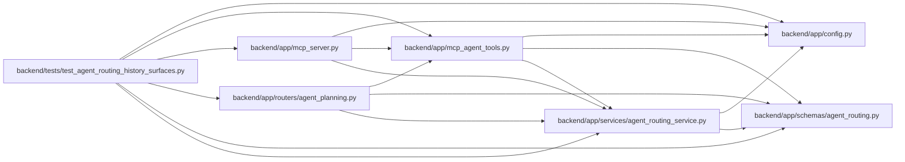

# test_agent_routing_history_surfaces Module

**Path:** `backend/tests/test_agent_routing_history_surfaces.py`

## Description

Contract and parity coverage for routing-assessment history surfaces.

## Imports

| Source | Symbols |
|--------|---------|
| `__future__` | `annotations` |
| `app` | `mcp_agent_tools` |
| `app.config` | `get_settings` |
| `app.mcp_server` | `ROUTING_READ_SCOPE_REQUIREMENT`, `mcp` |
| `app.routers` | `agent_planning` |
| `app.schemas.agent_routing` | `TaskRoutingAssessmentListResponse`, `TaskRoutingAssessmentResponse` |
| `app.services.agent_routing_service` | `_ROUTING_READ_SCOPES` |
| `datetime` | `UTC`, `datetime` |
| `pytest` | `pytest` |
| `types` | `SimpleNamespace` |
| `typing` | `Any` |

## Local dependency map

<!-- Auto-generated local dependency summary. Do not edit by hand. -->

### Internal neighbors

| Direction | Module |
|---|---|
| Outbound | [config](../modules/config.md) |
| Outbound | [mcp_agent_tools](../modules/mcp_agent_tools.md) |
| Outbound | [mcp_server](../modules/mcp_server.md) |
| Outbound | [routers_agent_planning](../modules/routers_agent_planning.md) |
| Outbound | [agent_routing](../modules/agent_routing.md) |
| Outbound | [agent_routing_service](../modules/agent_routing_service.md) |

### External packages

| Language | Used packages | Undeclared packages |
|---|---:|---:|
| python | 1 | 1 |

## Functions

| Function | Signature | Decorators | Description |
|----------|-----------|------------|-------------|
| `_history` | `() -> TaskRoutingAssessmentListResponse` | — | — |
| `test_routing_assessment_history_rest_and_mcp_are_bounded_and_equal` | *(async)* `(monkeypatch: pytest.MonkeyPatch) -> None` | `@pytest.mark.contract`, `@pytest.mark.asyncio` | — |
| `test_routing_assessment_history_route_and_tool_are_registered` | *(async)* `() -> None` | `@pytest.mark.contract`, `@pytest.mark.asyncio` | — |
