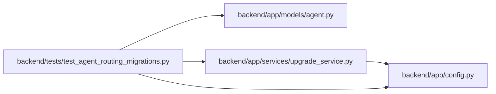

# test_agent_routing_migrations Module

**Path:** `backend/tests/test_agent_routing_migrations.py`

## Description

Alembic and cross-dialect DDL coverage for routing Wave 1.

## Imports

| Source | Symbols |
|--------|---------|
| `__future__` | `annotations` |
| `alembic` | `command` |
| `alembic.script` | `ScriptDirectory` |
| `app.config` | `get_settings` |
| `app.models.agent` | `AgentModelBinding`, `AgentModelCatalogEntry`, `AgentRun`, `AgentTaskAssignment`, `TaskRoutingAssessment` |
| `app.services.upgrade_service` | `alembic_config` |
| `datetime` | `UTC`, `datetime` |
| `pathlib` | `Path` |
| `pytest` | `pytest` |
| `sqlalchemy` | `create_engine`, `inspect`, `text` |
| `sqlalchemy.dialects` | `postgresql` |
| `sqlalchemy.exc` | `IntegrityError` |
| `sqlalchemy.schema` | `CreateIndex`, `CreateTable` |

## Local dependency map

<!-- Auto-generated local dependency summary. Do not edit by hand. -->

### Internal neighbors

| Direction | Module |
|---|---|
| Outbound | [config](../modules/config.md) |
| Outbound | [models_agent](../modules/models_agent.md) |
| Outbound | [upgrade_service](../modules/upgrade_service.md) |

### External packages

| Language | Used packages | Undeclared packages |
|---|---:|---:|
| python | 3 | 1 |

## Functions

| Function | Signature | Decorators | Description |
|----------|-----------|------------|-------------|
| `routing_migration_config` | `(tmp_path: Path, monkeypatch: pytest.MonkeyPatch)` | `@pytest.fixture` | — |
| `_sync_url` | `(path: Path) -> str` | — | — |
| `test_upgrade_downgrade_upgrade_from_empty_database` | `(routing_migration_config) -> None` | `@pytest.mark.sqlite` | — |
| `test_legacy_assignment_and_model_less_run_survive_upgrade` | `(routing_migration_config) -> None` | `@pytest.mark.sqlite` | — |
| `test_postgresql_ddl_contains_partial_default_and_audit_foreign_keys` | `() -> None` | `@pytest.mark.contract` | — |
| `test_alembic_reports_exactly_one_head` | `() -> None` | `@pytest.mark.contract` | — |
