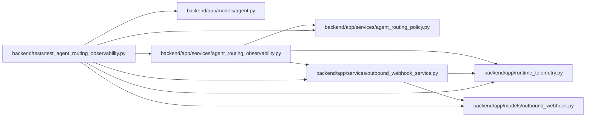

# test_agent_routing_observability Module

**Path:** `backend/tests/test_agent_routing_observability.py`

## Description

Security and persistence coverage for bounded routing telemetry.

## Imports

| Source | Symbols |
|--------|---------|
| `__future__` | `annotations` |
| `app.models.agent` | `TaskEvent` |
| `app.models.outbound_webhook` | `OutboundWebhookEvent` |
| `app.runtime_telemetry` | `metrics` |
| `app.services.agent_routing_observability` | `MAX_ROUTING_OPERATIONAL_CODES`, `MAX_ROUTING_OPERATIONAL_EVENT_BYTES`, `MAX_ROUTING_OPERATIONAL_EXCLUSION_CODES`, `MAX_ROUTING_OPERATIONAL_EXCLUSIONS`, `RoutingOperationalEvent`, `build_routing_operational_payload`, `record_routing_operational_event`, `routing_exclusion_projection` |
| `app.services.agent_routing_policy` | `canonical_routing_json_bytes` |
| `app.services.outbound_webhook_service` | `KNOWN_WEBHOOK_EVENT_TYPES` |
| `json` | `json` |
| `pytest` | `pytest` |
| `sqlalchemy` | `select` |
| `sqlalchemy.ext.asyncio` | `AsyncSession` |

## Local dependency map

<!-- Auto-generated local dependency summary. Do not edit by hand. -->

### Internal neighbors

| Direction | Module |
|---|---|
| Outbound | [models_agent](../modules/models_agent.md) |
| Outbound | [models_outbound_webhook](../modules/models_outbound_webhook.md) |
| Outbound | [runtime_telemetry](../modules/runtime_telemetry.md) |
| Outbound | [agent_routing_observability](../modules/agent_routing_observability.md) |
| Outbound | [agent_routing_policy](../modules/agent_routing_policy.md) |
| Outbound | [outbound_webhook_service](../modules/outbound_webhook_service.md) |

### External packages

| Language | Used packages | Undeclared packages |
|---|---:|---:|
| python | 2 | 1 |

## Functions

| Function | Signature | Decorators | Description |
|----------|-----------|------------|-------------|
| `test_routing_operational_events_are_closed_redacted_and_bounded` | `(event: RoutingOperationalEvent) -> None` | `@pytest.mark.contract`, `@pytest.mark.parametrize('event', list(RoutingOperationalEvent))` | — |
| `test_routing_operational_events_require_their_audit_identity` | `(event: RoutingOperationalEvent) -> None` | `@pytest.mark.contract`, `@pytest.mark.parametrize('event', list(RoutingOperationalEvent))` | — |
| `test_routing_failure_category_uses_a_closed_taxonomy` | `() -> None` | `@pytest.mark.contract` | — |
| `test_dedicated_routing_webhook_catalog_is_complete` | `() -> None` | `@pytest.mark.contract` | — |
| `test_worst_case_exclusion_projection_stays_within_event_byte_cap` | `() -> None` | `@pytest.mark.contract` | — |
| `test_routing_operational_event_stages_equivalent_task_and_webhook_rows` | *(async)* `(db_session: AsyncSession, actor_factory, task_factory) -> None` | `@pytest.mark.asyncio` | — |
