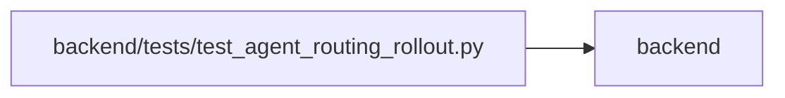

# test_agent_routing_rollout Module

**Path:** `backend/tests/test_agent_routing_rollout.py`

## Description

Focused qualification for model-aware routing rollout controls.

## Imports

| Source | Symbols |
|--------|---------|
| `__future__` | `annotations` |
| `app.agent_contract` | `MODEL_AWARE_ROUTING_FEATURE`, `agent_contract_features` |
| `app.config` | `Settings`, `get_settings` |
| `app.main` | `app` |
| `app.mcp_agent_tools` | `get_agent_capabilities` |
| `app.models.agent` | `AgentActor`, `AgentModelBinding`, `AgentModelCatalogEntry`, `AgentRun`, `AgentTaskAssignment`, `TaskEvent` |
| `app.models.outbound_webhook` | `OutboundWebhookEvent` |
| `app.routers.agent` | `get_agent_capabilities` |
| `app.schemas.agent` | `AgentReviewVerdict`, `AgentRoutingRolloutStatusResponse` |
| `app.services.agent_routing_observability` | `RoutingOperationalEvent`, `record_routing_operational_event` |
| `app.services.agent_routing_policy` | `canonical_routing_json_bytes` |
| `app.services.agent_routing_rollout` | `AgentRoutingRolloutError`, `AgentRoutingRolloutMode`, `AgentRoutingRolloutService`, `AgentRoutingTopologyReadiness`, `reset_agent_routing_topology_readiness`, `set_agent_routing_topology_readiness` |
| `app.services.agent_routing_service` | `AgentRoutingConflictError` |
| `app.services.agent_skill_bundle_service` | `AgentSkillBundleService` |
| `app.services.agent_work_service` | `AgentWorkService` |
| `app.utils.time` | `utc_now` |
| `datetime` | `date` |
| `json` | `json` |
| `pydantic` | `ValidationError` |
| `pytest` | `pytest` |
| `sqlalchemy` | `select` |
| `sqlalchemy.ext.asyncio` | `AsyncSession` |
| `starlette.requests` | `Request` |
| `typing` | `Any` |

## Local dependency map

<!-- Auto-generated local dependency summary. Do not edit by hand. -->

> Module-level dependencies exceed the generated-diagram limits, so the diagram and table below group them by top-level package. Counts report the number of module neighbors in each package.

### Internal neighbors

| Direction | Module |
|---|---|
| Outbound | `backend` (15) |

### External packages

| Language | Used packages | Undeclared packages |
|---|---:|---:|
| python | 4 | 2 |

> All 15 module neighbor(s) are summarized by package because the module-level view exceeds the 12-node limit.

## Functions

| Function | Signature | Decorators | Description |
|----------|-----------|------------|-------------|
| `_settings` | `(mode: str) -> Settings` | — | — |
| `_assert_secret_free` | `(value: Any) -> None` | — | — |
| `test_rollout_configuration_defaults_off_and_rejects_unknown_modes` | `() -> None` | — | — |
| `test_unconfigured_runtime_context_is_off_and_unadvertised` | `(monkeypatch: pytest.MonkeyPatch) -> None` | — | — |
| `test_topology_readiness_contract_is_versioned_bounded_and_fail_closed` | `() -> None` | — | — |
| `test_non_off_modes_fail_closed_without_ready_topology` | `(configured_mode: str) -> None` | `@pytest.mark.parametrize('configured_mode', ('shadow', 'enforced'))` | — |
| `test_ready_shadow_allows_preview_but_never_enforced_dispatch` | `() -> None` | — | — |
| `test_ready_enforced_mode_allows_preview_and_enforced_dispatch` | `() -> None` | — | — |
| `test_rest_and_mcp_capabilities_share_fail_closed_rollout_status` | *(async)* `(monkeypatch: pytest.MonkeyPatch) -> None` | `@pytest.mark.asyncio` | — |
| `test_rest_and_mcp_preserve_maximum_readiness_blocker_projection` | *(async)* `(monkeypatch: pytest.MonkeyPatch) -> None` | `@pytest.mark.asyncio` | — |
| `test_feature_off_rollback_preserves_representative_routing_history` | *(async)* `(db_session: AsyncSession, actor_factory, task_factory) -> None` | `@pytest.mark.asyncio` | — |
| `test_rollback_blocks_queued_model_aware_work_until_enforced` | *(async)* `(db_session: AsyncSession, profile_factory, actor_factory, team_member_factory, task_factory) -> None` | `@pytest.mark.asyncio` | — |
| `test_inactive_rollout_blocks_queued_model_aware_verification_review` | *(async)* `(mode: str, db_session: AsyncSession, profile_factory, actor_factory, task_factory) -> None` | `@pytest.mark.parametrize('mode', ('off', 'shadow'))`, `@pytest.mark.asyncio` | — |
