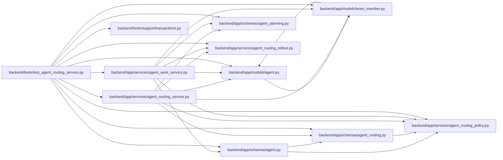

# test_agent_routing_service Module

**Path:** `backend/tests/test_agent_routing_service.py`

## Description

End-to-end service coverage for authoritative Wave 3 routing.

## Imports

| Source | Symbols |
|--------|---------|
| `__future__` | `annotations` |
| `app.models.agent` | `AgentActor`, `AgentModelBinding`, `AgentModelCatalogEntry`, `AgentTaskAssignment`, `TaskEvent` |
| `app.models.team_member` | `TeamMemberProfileSkill` |
| `app.schemas.agent` | `AgentTaskAssignmentCreate`, `AgentReviewVerdict`, `ModelAwareAgentTaskAssignmentCreate`, `ModelAwareAgentTaskAssignmentUpdate`, `ModelAwareAgentWorkBegin` |
| `app.schemas.agent_planning` | `AgentPlanningCommandContext` |
| `app.schemas.agent_routing` | `AgentRoutingPreviewCreate`, `TaskRoutingAssessmentCommand` |
| `app.services.agent_routing_policy` | `ROUTING_POLICY_VERSION` |
| `app.services.agent_routing_rollout` | `AgentRoutingRolloutService`, `AgentRoutingTopologyReadiness` |
| `app.services.agent_routing_service` | `AgentRoutingConflictError`, `AgentRoutingService` |
| `app.services.agent_work_service` | `AgentWorkService` |
| `asyncio` | `asyncio` |
| `datetime` | `UTC`, `date`, `datetime` |
| `json` | `json` |
| `pytest` | `pytest` |
| `sqlalchemy` | `select` |
| `sqlalchemy.ext.asyncio` | `AsyncSession` |
| `tests.support.transactions` | `reload_session_fixture` |
| `types` | `SimpleNamespace` |

## Local dependency map

<!-- Auto-generated local dependency summary. Do not edit by hand. -->

### Internal neighbors

| Direction | Module |
|---|---|
| Outbound | [models_agent](../modules/models_agent.md) |
| Outbound | [team_member](../modules/team_member.md) |
| Outbound | [schemas_agent](../modules/schemas_agent.md) |
| Outbound | [schemas_agent_planning](../modules/schemas_agent_planning.md) |
| Outbound | [agent_routing](../modules/agent_routing.md) |
| Outbound | [agent_routing_policy](../modules/agent_routing_policy.md) |
| Outbound | [agent_routing_rollout](../modules/agent_routing_rollout.md) |
| Outbound | [agent_routing_service](../modules/agent_routing_service.md) |
| Outbound | [agent_work_service](../modules/agent_work_service.md) |
| Outbound | [transactions](../modules/transactions.md) |

### External packages

| Language | Used packages | Undeclared packages |
|---|---:|---:|
| python | 2 | 1 |

## Functions

| Function | Signature | Decorators | Description |
|----------|-----------|------------|-------------|
| `_assessment_command` | `(*, task_version: int) -> TaskRoutingAssessmentCommand` | — | — |
| `_command_context` | `(key: str) -> AgentPlanningCommandContext` | — | — |
| `_rollout` | `(mode: str) -> AgentRoutingRolloutService` | — | — |
| `_routing_fixture` | *(async)* `(db_session: AsyncSession, profile_factory, actor_factory, team_member_factory, task_factory)` | — | — |
| `test_assessment_lifecycle_is_replay_safe_and_version_bound` | *(async)* `(db_session: AsyncSession, actor_factory, task_factory) -> None` | `@pytest.mark.asyncio` | — |
| `test_untrusted_legacy_lineage_cannot_raise_assessment_review_floor` | *(async)* `(db_session: AsyncSession, profile_factory, actor_factory, team_member_factory, task_factory) -> None` | `@pytest.mark.asyncio` | — |
| `test_selection_input_fence_serializes_sqlite_routing_transactions` | *(async)* `(db_session: AsyncSession, db_session_factory, task_factory) -> None` | `@pytest.mark.asyncio` | — |
| `test_assessment_history_trims_deterministic_tail_to_packet_limit` | *(async)* `(db_session: AsyncSession, actor_factory, task_factory) -> None` | `@pytest.mark.asyncio` | — |
| `test_preview_is_deterministic_and_relevant_mutation_invalidates_it` | *(async)* `(db_session: AsyncSession, profile_factory, actor_factory, team_member_factory, task_factory) -> None` | `@pytest.mark.asyncio` | — |
| `test_verification_independence_requires_authoritative_profile_history` | *(async)* `(snapshot_authority: str \| None, expected_blocker: str, db_session: AsyncSession, profile_factory, actor_factory, team_member_factory, task_factory) -> None` | `@pytest.mark.asyncio`, `@pytest.mark.parametrize(('snapshot_authority', 'expected_blocker'), (('agent-routing-service-v1', 'verification_profile_not_independent'), (None, 'verification_independence_unverifiable')))` | — |
| `test_model_aware_assignment_and_begin_enforce_observed_model` | *(async)* `(db_session: AsyncSession, profile_factory, actor_factory, team_member_factory, task_factory) -> None` | `@pytest.mark.asyncio` | — |
| `test_completed_rework_update_persists_prior_and_new_routing_lineage` | *(async)* `(db_session: AsyncSession, profile_factory, actor_factory, team_member_factory, task_factory) -> None` | `@pytest.mark.asyncio` | — |
| `test_rejection_telemetry_normalizes_adversarial_legacy_lineage` | *(async)* `(db_session: AsyncSession, profile_factory, actor_factory, task_factory) -> None` | `@pytest.mark.asyncio` | — |
