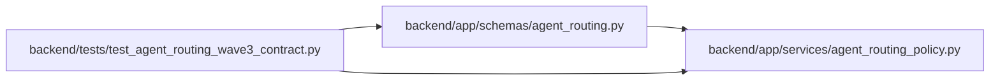

# test_agent_routing_wave3_contract Module

**Path:** `backend/tests/test_agent_routing_wave3_contract.py`

## Description

Focused policy and schema contracts for deterministic Wave 3 routing.

## Imports

| Source | Symbols |
|--------|---------|
| `app.schemas.agent_routing` | `AgentRoutingCandidate`, `AgentRoutingExclusion`, `AgentRoutingPreviewCreate`, `AgentRoutingPreviewResponse`, `RoutingDecisionSnapshot`, `RoutingTrustLineage`, `TaskRoutingAssessmentCommand`, `TaskRoutingAssessmentListResponse`, `TaskRoutingAssessmentResponse`, `TaskRoutingAssessmentState` |
| `app.services.agent_routing_policy` | `MAX_ROUTING_CANDIDATES`, `MAX_ROUTING_EXCLUSIONS`, `MIN_ROUTING_ASSESSMENT_CONFIDENCE`, `ROUTING_PREVIEW_TTL_SECONDS`, `RoutingBlockerCode`, `evaluate_model_envelope`, `evaluate_required_skills`, `routing_candidate_rank_key` |
| `datetime` | `UTC`, `datetime`, `timedelta` |
| `pydantic` | `ValidationError` |
| `pytest` | `pytest` |

## Local dependency map

<!-- Auto-generated local dependency summary. Do not edit by hand. -->

### Internal neighbors

| Direction | Module |
|---|---|
| Outbound | [agent_routing](../modules/agent_routing.md) |
| Outbound | [agent_routing_policy](../modules/agent_routing_policy.md) |

### External packages

| Language | Used packages | Undeclared packages |
|---|---:|---:|
| python | 2 | 1 |

## Functions

| Function | Signature | Decorators | Description |
|----------|-----------|------------|-------------|
| `_assessment_command` | `(**overrides: object) -> dict[str, object]` | — | — |
| `_assessment_response` | `(*, is_current: bool = True) -> TaskRoutingAssessmentResponse` | — | — |
| `_candidate` | `(**overrides: object) -> AgentRoutingCandidate` | — | — |
| `test_wave3_policy_limits_and_blocker_vocabulary_are_frozen` | `() -> None` | `@pytest.mark.contract` | — |
| `test_required_skill_decision_is_deterministic_and_fail_closed` | `() -> None` | `@pytest.mark.contract` | — |
| `test_model_envelope_and_rank_inputs_never_trade_eligibility_for_cost` | `() -> None` | `@pytest.mark.contract` | — |
| `test_assessment_command_owns_only_client_fields_and_rejects_low_confidence` | `() -> None` | `@pytest.mark.contract` | — |
| `test_assessment_state_and_history_are_explicit_and_version_bound` | `() -> None` | `@pytest.mark.contract` | — |
| `test_preview_contract_accepts_eligible_and_explicit_no_candidate_states` | `() -> None` | `@pytest.mark.contract` | — |
| `test_routing_decision_snapshot_is_immutable_and_preserves_trust_lineage` | `() -> None` | `@pytest.mark.contract` | — |
