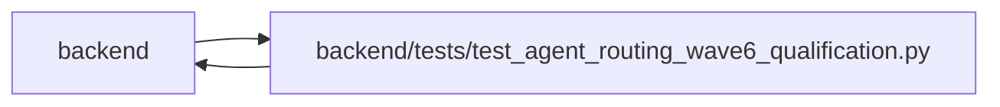

# test_agent_routing_wave6_qualification Module

**Path:** `backend/tests/test_agent_routing_wave6_qualification.py`

## Description

Cross-surface qualification scenarios for model-aware agent routing.

## Imports

| Source | Symbols |
|--------|---------|
| `__future__` | `annotations` |
| `app` | `mcp_agent_tools` |
| `app.models.agent` | `AgentActor`, `AgentModelBinding`, `AgentModelCatalogEntry`, `AgentRun`, `AgentTaskAssignment`, `TaskEvent` |
| `app.models.task` | `Task` |
| `app.models.team_member` | `TeamMember`, `TeamMemberProfile`, `TeamMemberProfileSkill` |
| `app.routers` | `agent`, `agent_planning` |
| `app.schemas.agent` | `AgentTaskAssignmentUpdate`, `ModelAwareAgentTaskAssignmentCreate`, `ModelAwareAgentTaskAssignmentUpdate`, `ModelAwareAgentWorkBegin` |
| `app.schemas.agent_planning` | `AgentPlanningCommandContext` |
| `app.schemas.agent_routing` | `AgentRoutingPreviewCreate`, `AgentRoutingPreviewResponse`, `TaskRoutingAssessmentCommand`, `TaskRoutingAssessmentResponse` |
| `app.services.agent_routing_policy` | `derive_difficulty_band`, `minimum_review_mode` |
| `app.services.agent_routing_service` | `AgentRoutingConflictError`, `AgentRoutingService` |
| `app.services.agent_work_service` | `AgentWorkService` |
| `app.services.assignee_recommendation_service` | `AssigneeRecommendationService` |
| `dataclasses` | `dataclass` |
| `datetime` | `UTC`, `date`, `datetime` |
| `hashlib` | `hashlib` |
| `json` | `json` |
| `pytest` | `pytest` |
| `sqlalchemy` | `select` |
| `sqlalchemy.ext.asyncio` | `AsyncSession` |
| `typing` | `Any` |

## Local dependency map

<!-- Auto-generated local dependency summary. Do not edit by hand. -->

> Module-level dependencies exceed the generated-diagram limits, so the diagram and table below group them by top-level package. Counts report the number of module neighbors in each package.

### Internal neighbors

| Direction | Module |
|---|---|
| Inbound | `backend` (1) |
| Outbound | `backend` (13) |

### External packages

| Language | Used packages | Undeclared packages |
|---|---:|---:|
| python | 2 | 1 |

> All 14 module neighbor(s) are summarized by package because the module-level view exceeds the 12-node limit.

## Classes

| Class | Line | Bases | Description |
|-------|------|-------|-------------|
| [ScenarioBase](../entities/ScenarioBase.md) | 85 | — | — |
| [Candidate](../entities/Candidate.md) | 93 | — | — |
| [PersistedState](../entities/PersistedState.md) | 100 | — | — |

## Functions

| Function | Signature | Decorators | Description |
|----------|-----------|------------|-------------|
| `fixed_wave6_clock` | `(monkeypatch: pytest.MonkeyPatch) -> None` | `@pytest.fixture(autouse=True)` | Keep preview IDs, expiry checks, and work fences byte-deterministic. |
| `_seed_base` | *(async)* `(db: AsyncSession, *, profile_factory: Any, actor_factory: Any, team_member_factory: Any, task_factory: Any, skill_key: str = 'backend-python', skill_level: int = 4, status: str = 'planned', title: str = 'Bounded Python change') -> ScenarioBase` | — | — |
| `_add_binding` | *(async)* `(db: AsyncSession, *, actor: AgentActor, key: str, reasoning_tier: int, context_tier: str, cost_tier: str, latency_tier: str = 'balanced', tool_tags: tuple[str, ...] = (), data_policy_tags: tuple[str, ...] = (), is_default: bool = False) -> Candidate` | — | — |
| `_add_candidate` | *(async)* `(db: AsyncSession, *, actor_factory: Any, profile: TeamMemberProfile, key: str, reasoning_tier: int, context_tier: str, cost_tier: str, latency_tier: str = 'balanced', tool_tags: tuple[str, ...] = (), data_policy_tags: tuple[str, ...] = (), role: str = 'worker') -> Candidate` | — | — |
| `_assessment_command` | `(*, task_version: int, required_skill_levels: dict[str, int], minimum_reasoning_tier: int = 1, minimum_context_tier: str = 'small', tool_tags: tuple[str, ...] = (), data_policy_tags: tuple[str, ...] = (), axes: dict[str, int] \| None = None, reason_codes: tuple[str, ...] = (), review_mode: str \| None = None) -> TaskRoutingAssessmentCommand` | — | — |
| `_create_assessment_with_parity` | *(async)* `(db: AsyncSession, *, base: ScenarioBase, data: TaskRoutingAssessmentCommand, key: str) -> TaskRoutingAssessmentResponse` | — | — |
| `_preview_with_parity` | *(async)* `(db: AsyncSession, *, base: ScenarioBase, assessment: TaskRoutingAssessmentResponse, purpose: str = 'execution', reviewer_profile_id: int \| None = None) -> AgentRoutingPreviewResponse` | — | — |
| `_dispatch` | *(async)* `(db: AsyncSession, *, base: ScenarioBase, assessment: TaskRoutingAssessmentResponse, preview: AgentRoutingPreviewResponse, candidate: Candidate, key: str, purpose: str = 'execution', queue_class: str = 'normal', reviewer_profile_id: int \| None = None)` | — | — |
| `_persisted_state` | *(async)* `(db: AsyncSession, task_id: int) -> PersistedState` | — | — |
| `_event_payload` | `(event: TaskEvent) -> dict[str, Any]` | — | — |
| `_exclusion` | `(preview: AgentRoutingPreviewResponse, *, actor_id: int, binding_id: int \| None = None)` | — | — |
| `_assert_selected_snapshot` | `(snapshot: dict[str, Any], *, candidate: Candidate, assessment: TaskRoutingAssessmentResponse) -> None` | — | — |
| `_prior_snapshot` | `(*, task: Task, candidate: Candidate, profile: TeamMemberProfile, assessment_id: int) -> dict[str, Any]` | — | — |
| `_seed_rework_scenario` | *(async)* `(db: AsyncSession, *, profile_factory: Any, actor_factory: Any, team_member_factory: Any, task_factory: Any, failure_category: str, key: str)` | — | — |
| `test_wave6_scenario_01_routine_task_selects_adequate_low_cost_binding` | *(async)* `(db_session: AsyncSession, profile_factory, actor_factory, team_member_factory, task_factory) -> None` | `@pytest.mark.sqlite`, `@pytest.mark.asyncio` | — |
| `test_wave6_scenario_02_advanced_task_excludes_routine_model` | *(async)* `(db_session: AsyncSession, profile_factory, actor_factory, team_member_factory, task_factory) -> None` | `@pytest.mark.sqlite`, `@pytest.mark.asyncio` | — |
| `test_wave6_scenario_03_high_risk_migration_routes_independent_specialist` | *(async)* `(db_session: AsyncSession, profile_factory, actor_factory, team_member_factory, task_factory) -> None` | `@pytest.mark.sqlite`, `@pytest.mark.asyncio` | — |
| `test_wave6_scenario_04_large_documentation_prefers_context_adequacy` | *(async)* `(db_session: AsyncSession, profile_factory, actor_factory, team_member_factory, task_factory) -> None` | `@pytest.mark.sqlite`, `@pytest.mark.asyncio` | — |
| `test_wave6_scenario_05_missing_tool_and_data_policy_fails_closed` | *(async)* `(db_session: AsyncSession, profile_factory, actor_factory, team_member_factory, task_factory) -> None` | `@pytest.mark.sqlite`, `@pytest.mark.asyncio` | — |
| `test_wave6_scenario_06_stale_binding_rejects_preview_selection_atomically` | *(async)* `(db_session: AsyncSession, profile_factory, actor_factory, team_member_factory, task_factory) -> None` | `@pytest.mark.sqlite`, `@pytest.mark.asyncio` | — |
| `test_wave6_scenario_07_material_model_mismatch_blocks_begin_atomically` | *(async)* `(db_session: AsyncSession, profile_factory, actor_factory, team_member_factory, task_factory) -> None` | `@pytest.mark.sqlite`, `@pytest.mark.asyncio` | — |
| `test_wave6_scenario_08_reasoning_rejection_permits_explicit_escalation` | *(async)* `(db_session: AsyncSession, profile_factory, actor_factory, team_member_factory, task_factory) -> None` | `@pytest.mark.sqlite`, `@pytest.mark.asyncio` | — |
| `test_wave6_scenario_09_external_blocker_cannot_escalate_model_tier` | *(async)* `(db_session: AsyncSession, profile_factory, actor_factory, team_member_factory, task_factory) -> None` | `@pytest.mark.sqlite`, `@pytest.mark.asyncio` | — |
| `test_legacy_lineage_cannot_forge_model_escalation_eligibility` | *(async)* `(forged_schema: str, db_session: AsyncSession, profile_factory, actor_factory, team_member_factory, task_factory) -> None` | `@pytest.mark.sqlite`, `@pytest.mark.asyncio`, `@pytest.mark.parametrize('forged_schema', ('routing-lineage-snapshot-v1', 'caller-lineage-v1'))` | — |
| `test_completed_legacy_lineage_drops_arbitrary_private_fields` | *(async)* `(db_session: AsyncSession, profile_factory, actor_factory, team_member_factory, task_factory) -> None` | `@pytest.mark.sqlite`, `@pytest.mark.asyncio` | — |
| `test_wave6_scenario_10_capacity_recommendations_remain_unchanged` | *(async)* `(db_session: AsyncSession, profile_factory, actor_factory, team_member_factory, task_factory) -> None` | `@pytest.mark.sqlite`, `@pytest.mark.asyncio` | — |
| `test_wave6_scenario_11_reassignment_without_fresh_preview_is_rejected` | *(async)* `(db_session: AsyncSession, profile_factory, actor_factory, team_member_factory, task_factory) -> None` | `@pytest.mark.sqlite`, `@pytest.mark.asyncio` | — |
| `test_wave6_scenario_12_matching_self_report_is_unattested_and_mismatch_inert` | *(async)* `(db_session: AsyncSession, profile_factory, actor_factory, team_member_factory, task_factory) -> None` | `@pytest.mark.sqlite`, `@pytest.mark.asyncio` | — |
