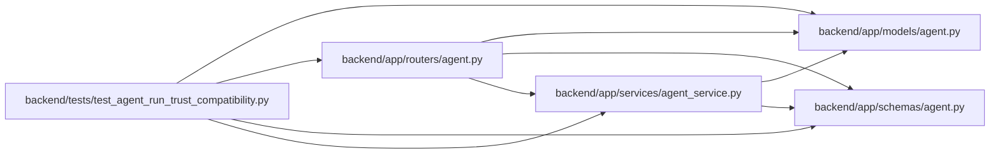

# test_agent_run_trust_compatibility Module

**Path:** `backend/tests/test_agent_run_trust_compatibility.py`

## Description

Compatibility coverage for persisted and projected run-model trust evidence.

## Imports

| Source | Symbols |
|--------|---------|
| `__future__` | `annotations` |
| `app.models.agent` | `AgentActor`, `AgentRun` |
| `app.routers.agent` | `_run_detail_response`, `_run_response` |
| `app.schemas.agent` | `AgentRunCreate` |
| `app.services.agent_service` | `AgentService` |
| `datetime` | `UTC`, `datetime` |
| `json` | `json` |
| `pytest` | `pytest` |
| `typing` | `Any` |

## Local dependency map

<!-- Auto-generated local dependency summary. Do not edit by hand. -->

### Internal neighbors

| Direction | Module |
|---|---|
| Outbound | [models_agent](../modules/models_agent.md) |
| Outbound | [routers_agent](../modules/routers_agent.md) |
| Outbound | [schemas_agent](../modules/schemas_agent.md) |
| Outbound | [agent_service](../modules/agent_service.md) |

### External packages

| Language | Used packages | Undeclared packages |
|---|---:|---:|
| python | 1 | 1 |

## Functions

| Function | Signature | Decorators | Description |
|----------|-----------|------------|-------------|
| `test_legacy_run_start_classifies_reported_model_evidence` | *(async)* `(monkeypatch: pytest.MonkeyPatch, reported_model: str \| None, expected_trust_state: str) -> None` | `@pytest.mark.asyncio`, `@pytest.mark.parametrize(('reported_model', 'expected_trust_state'), [(None, 'unreported'), ('   ', 'unreported'), ('legacy-runtime-alias', 'unverifiable')])` | — |
| `test_rest_run_projections_preserve_binding_and_model_trust_evidence` | `() -> None` | `@pytest.mark.contract` | — |
