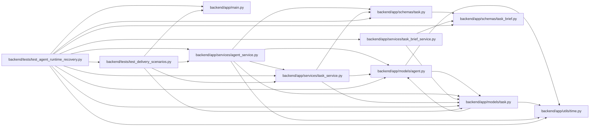

# test_agent_runtime_recovery Module

**Path:** `backend/tests/test_agent_runtime_recovery.py`

## Description

SQLite and PostgreSQL scenarios use new peer processes for begin, resume, renew, terminal submission, independent review and PM recovery. Lost-response replay is represented by retrying the exact logical request after process exit. Expired fences and changed criterion revisions reject stale evidence; provisional lineage remains blocked until an explicit supervised PM reassignment in routing-off mode. Timeout cleanup kills only the owned peer process.

Separate-process protocol simulation; no provider or pilot acceptance implied.

## Imports

| Source | Symbols |
|--------|---------|
| `app.main` | `app` |
| `app.models.agent` | `AgentActor`, `AgentTaskAssignment`, `AgentRun` |
| `app.models.task` | `Task` |
| `app.schemas.task` | `TaskCreate` |
| `app.schemas.task_brief` | `BriefCriterion`, `BriefWrite`, `TaskBrief` |
| `app.services.agent_service` | `hash_api_key` |
| `app.services.task_brief_service` | `TaskBriefService` |
| `app.services.task_service` | `TaskService` |
| `app.utils.time` | `utc_now` |
| `asyncio` | `asyncio` |
| `datetime` | `date`, `timedelta` |
| `httpx` | `httpx` |
| `json` | `json` |
| `os` | `os` |
| `pytest` | `pytest` |
| `sqlalchemy` | `select` |
| `sys` | `sys` |
| `tests.test_delivery_scenarios` | `delivery_store` |

## Local dependency map

<!-- Auto-generated local dependency summary. Do not edit by hand. -->

### Internal neighbors

| Direction | Module |
|---|---|
| Outbound | [app_main](../modules/app_main.md) |
| Outbound | [models_agent](../modules/models_agent.md) |
| Outbound | [models_task](../modules/models_task.md) |
| Outbound | [schemas_task](../modules/schemas_task.md) |
| Outbound | [schemas_task_brief](../modules/schemas_task_brief.md) |
| Outbound | [agent_service](../modules/agent_service.md) |
| Outbound | [task_brief_service](../modules/task_brief_service.md) |
| Outbound | [task_service](../modules/task_service.md) |
| Outbound | [time](../modules/time.md) |
| Outbound | [test_delivery_scenarios](../modules/test_delivery_scenarios.md) |

### External packages

| Language | Used packages | Undeclared packages |
|---|---:|---:|
| python | 3 | 1 |

## Functions

| Function | Signature | Decorators | Description |
|----------|-----------|------------|-------------|
| `peer` | *(async)* `(factory, key, action, *, body = None, idempotency_key = None, **extra)` | — | — |
| `fence` | `(receipt)` | — | — |
| `seed_work` | *(async)* `(factory, scenario)` | — | — |
| `begin_next` | *(async)* `(factory, key, logical_key)` | — | — |
| `review_assignment` | *(async)* `(factory, task_id, actor_id)` | — | — |
| `supervised_refresh` | *(async)* `(factory, scenario, task_id)` | — | A worker pauses; an explicit PM replaces provisional lineage in off mode. |
| `test_process_restart_ambiguous_replay_and_independent_rework` | *(async)* `(delivery_store)` | — | — |
| `test_process_restart_expired_fence_requeue_and_failure` | *(async)* `(delivery_store)` | — | — |
| `test_changed_criterion_invalidates_restarted_worker_evidence` | *(async)* `(delivery_store)` | — | — |