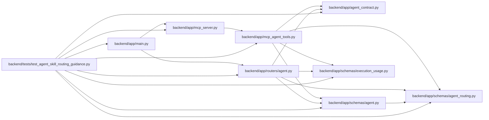

# test_agent_skill_routing_guidance Module

**Path:** `backend/tests/test_agent_skill_routing_guidance.py`

## Description

Contract coverage for MAR-SKILL-001, MAR-SKILL-002, and MAR-PKG-001.

## Imports

| Source | Symbols |
|--------|---------|
| `__future__` | `annotations` |
| `app` | `mcp_agent_tools` |
| `app.agent_contract` | `MODEL_AWARE_ROUTING_FEATURE`, `agent_contract_features` |
| `app.main` | `app` |
| `app.mcp_server` | `mcp` |
| `app.routers` | `agent` |
| `app.schemas.agent` | `AgentWorkSubmit`, `ModelAwareAgentTaskAssignmentCreate`, `ModelAwareAgentTaskAssignmentUpdate`, `ModelAwareAgentWorkBegin` |
| `app.schemas.agent_routing` | `AgentRoutingPreviewCreate`, `TaskRoutingAssessmentCommand` |
| `app.schemas.execution_usage` | `ExecutionUsageWrite` |
| `json` | `json` |
| `pathlib` | `Path` |
| `pytest` | `pytest` |
| `re` | `re` |
| `scripts` | `build_agent_skills` |

## Local dependency map

<!-- Auto-generated local dependency summary. Do not edit by hand. -->

### Internal neighbors

| Direction | Module |
|---|---|
| Outbound | [agent_contract](../modules/agent_contract.md) |
| Outbound | [app_main](../modules/app_main.md) |
| Outbound | [mcp_agent_tools](../modules/mcp_agent_tools.md) |
| Outbound | [mcp_server](../modules/mcp_server.md) |
| Outbound | [routers_agent](../modules/routers_agent.md) |
| Outbound | [schemas_agent](../modules/schemas_agent.md) |
| Outbound | [agent_routing](../modules/agent_routing.md) |
| Outbound | [schemas_execution_usage](../modules/schemas_execution_usage.md) |

### External packages

| Language | Used packages | Undeclared packages |
|---|---:|---:|
| python | 2 | 2 |

## Functions

| Function | Signature | Decorators | Description |
|----------|-----------|------------|-------------|
| `_read` | `(relative: str) -> str` | — | — |
| `_normalized` | `(relative: str) -> str` | — | — |
| `_operation` | `(operation_id: str) -> dict` | — | — |
| `_derived_band` | `(axes: tuple[int, int, int, int, int]) -> str` | — | — |
| `_schema_refs` | `(value: object) -> set[str]` | — | — |
| `test_pm_skill_covers_governed_difficulty_scenarios` | `(label: str, axes: tuple[int, int, int, int, int], expected: str) -> None` | `@pytest.mark.contract`, `@pytest.mark.parametrize(('label', 'axes', 'expected'), [('Known one-file text correction', (1, 1, 1, 1, 1), 'routine'), ('Normal multi-module feature', (2, 2, 2, 2, 2), 'standard'), ('Novel cross-repository migration', (3, 2, 3, 3, 3), 'advanced'), ('Small authentication permission change', (1, 1, 1, 3, 3), 'advanced'), ('Large repetitive rename', (1, 1, 1, 1, 1), 'routine')])` | — |
| `test_pm_skill_hard_gates_selection_before_cost` | `() -> None` | `@pytest.mark.contract` | — |
| `test_pm_skill_distinguishes_model_and_external_blockers` | `() -> None` | `@pytest.mark.contract` | — |
| `test_worker_skill_obeys_selected_binding_without_expanding_authority` | `() -> None` | `@pytest.mark.contract` | — |
| `test_model_aware_operation_contract_is_feature_gated` | `() -> None` | `@pytest.mark.contract` | — |
| `test_model_aware_package_contract_matches_live_rest_and_mcp` | *(async)* `() -> None` | `@pytest.mark.contract`, `@pytest.mark.asyncio` | — |
| `test_server_advertises_complete_model_aware_feature` | `() -> None` | `@pytest.mark.contract` | — |
| `test_role_versions_are_new_frozen_identities` | `() -> None` | `@pytest.mark.contract` | — |
| `test_generated_submission_contract_includes_canonical_progress` | `() -> None` | `@pytest.mark.contract` | — |
| `test_generated_usage_contract_matches_the_registered_schema` | `() -> None` | `@pytest.mark.contract` | — |
