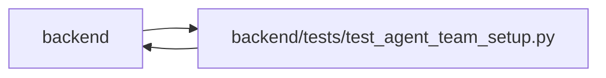

# test_agent_team_setup Module

**Path:** `backend/tests/test_agent_team_setup.py`

## Description

Contract and service coverage for portable agent-team setup.

## Imports

| Source | Symbols |
|--------|---------|
| `__future__` | `annotations` |
| `app` | `mcp_agent_tools` |
| `app.authority` | `internal_authority` |
| `app.commands` | `command_transaction` |
| `app.config` | `get_settings` |
| `app.database` | `get_db` |
| `app.main` | `app` |
| `app.mcp_server` | `mcp` |
| `app.models.agent` | `AgentActor`, `AgentModelCatalogEntry`, `AgentModelBinding`, `AgentTeamTopologyMember` |
| `app.models.identity` | `Principal`, `Principal`, `WorkspaceMembership` |
| `app.schemas.agent_planning` | `AgentPlanningCommandContext` |
| `app.schemas.agent_team_setup` | `MAX_AGENT_TEAM_MANIFEST_BYTES`, `AgentTeamApplyRequest`, `AgentTeamCurrentMember`, `AgentTeamCurrentSnapshot`, `AgentTeamManifestRequest`, `AgentTeamMaster`, `AgentTeamPlanRequest`, `AgentTeamReconciliationClass`, `AgentTeamRuntimeAcknowledgement`, `parse_agent_team_master`, `reconcile_agent_team_master` |
| `app.services.agent_service` | `AgentService`, `hash_api_key` |
| `app.services.agent_team_setup_service` | `AgentTeamSetupConflictError`, `AgentTeamSetupService` |
| `app.services.identity_service` | `initialize_control_plane` |
| `app.utils.time` | `utc_now` |
| `copy` | `deepcopy` |
| `httpx` | `httpx` |
| `json` | `json` |
| `pathlib` | `Path` |
| `pydantic` | `ValidationError` |
| `pytest` | `pytest` |
| `sqlalchemy` | `select` |
| `sqlalchemy.ext.asyncio` | `AsyncSession` |
| `tests.test_delivery_scenarios` | `delivery_store` |
| `typing` | `Any` |

## Local dependency map

<!-- Auto-generated local dependency summary. Do not edit by hand. -->

> Module-level dependencies exceed the generated-diagram limits, so the diagram and table below group them by top-level package. Counts report the number of module neighbors in each package.

### Internal neighbors

| Direction | Module |
|---|---|
| Inbound | `backend` (1) |
| Outbound | `backend` (16) |

### External packages

| Language | Used packages | Undeclared packages |
|---|---:|---:|
| python | 4 | 1 |

> All 17 module neighbor(s) are summarized by package because the module-level view exceeds the 12-node limit.

## Classes

| Class | Line | Bases | Description |
|-------|------|-------|-------------|
| [CapturingCredentialSink](../entities/CapturingCredentialSink.md) | 71 | — | — |
| [FailingOnceCredentialSink](../entities/FailingOnceCredentialSink.md) | 92 | `CapturingCredentialSink` | — |

## Functions

| Function | Signature | Decorators | Description |
|----------|-----------|------------|-------------|
| `example_payload` | `() -> dict[str, Any]` | — | — |
| `operator` | `() -> AgentActor` | — | — |
| `test_master_is_canonical_secret_free_and_forward_versioned` | `() -> None` | `@pytest.mark.contract` | — |
| `test_master_rejects_role_identity_binding_and_size_mutations` | `() -> None` | `@pytest.mark.contract` | — |
| `test_reconciliation_is_stable_and_never_hard_deletes` | `() -> None` | `@pytest.mark.contract` | — |
| `onboarding_access_mode` | `(request, monkeypatch)` | `@pytest.fixture(params=['trusted_local', 'managed'])` | — |
| `test_fresh_apply_replay_onboarding_and_runtime_readiness` | *(async)* `(db_session: AsyncSession, onboarding_access_mode) -> None` | `@pytest.mark.asyncio` | — |
| `test_confirmed_identity_replacement_disables_old_actor` | *(async)* `(db_session: AsyncSession) -> None` | `@pytest.mark.asyncio` | — |
| `test_uncertain_delivery_requires_explicit_new_reference_recovery` | *(async)* `(db_session: AsyncSession) -> None` | `@pytest.mark.asyncio` | — |
| `test_mcp_registers_secret_free_setup_status_read_only` | *(async)* `() -> None` | `@pytest.mark.asyncio` | — |
| `test_topologies_share_catalog_and_profile_references_not_identities` | *(async)* `(db_session: AsyncSession) -> None` | `@pytest.mark.asyncio` | — |
| `test_revision_bound_acknowledgement_with_database_scenarios` | *(async)* `(delivery_store, onboarding_access_mode)` | — | — |
