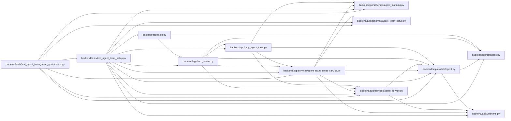

# test_agent_team_setup Module

**Path:** `backend/tests/test_agent_team_setup.py`

## Description

Contract and service coverage for portable agent-team setup.

## Imports

| Source | Symbols |
|--------|---------|
| `__future__` | `annotations` |
| `app` | `mcp_agent_tools` |
| `app.database` | `get_db` |
| `app.main` | `app` |
| `app.mcp_server` | `mcp` |
| `app.models.agent` | `AgentActor`, `AgentModelCatalogEntry`, `AgentTeamTopologyMember` |
| `app.schemas.agent_planning` | `AgentPlanningCommandContext` |
| `app.schemas.agent_team_setup` | `MAX_AGENT_TEAM_MANIFEST_BYTES`, `AgentTeamApplyRequest`, `AgentTeamCurrentMember`, `AgentTeamCurrentSnapshot`, `AgentTeamManifestRequest`, `AgentTeamMaster`, `AgentTeamPlanRequest`, `AgentTeamReconciliationClass`, `AgentTeamRuntimeAcknowledgement`, `parse_agent_team_master`, `reconcile_agent_team_master` |
| `app.services.agent_service` | `AgentService` |
| `app.services.agent_team_setup_service` | `AgentTeamSetupConflictError`, `AgentTeamSetupService` |
| `app.utils.time` | `utc_now` |
| `copy` | `deepcopy` |
| `httpx` | `httpx` |
| `json` | `json` |
| `pathlib` | `Path` |
| `pydantic` | `ValidationError` |
| `pytest` | `pytest` |
| `sqlalchemy` | `select` |
| `sqlalchemy.ext.asyncio` | `AsyncSession` |
| `typing` | `Any` |

## Local dependency map

<!-- Auto-generated local dependency summary. Do not edit by hand. -->

### Internal neighbors

| Direction | Module |
|---|---|
| Inbound | [test_agent_team_setup_qualification](../modules/test_agent_team_setup_qualification.md) |
| Outbound | [app_database](../modules/app_database.md) |
| Outbound | [app_main](../modules/app_main.md) |
| Outbound | [mcp_agent_tools](../modules/mcp_agent_tools.md) |
| Outbound | [mcp_server](../modules/mcp_server.md) |
| Outbound | [models_agent](../modules/models_agent.md) |
| Outbound | [schemas_agent_planning](../modules/schemas_agent_planning.md) |
| Outbound | [agent_team_setup](../modules/agent_team_setup.md) |
| Outbound | [agent_service](../modules/agent_service.md) |
| Outbound | [agent_team_setup_service](../modules/agent_team_setup_service.md) |
| Outbound | [time](../modules/time.md) |

### External packages

| Language | Used packages | Undeclared packages |
|---|---:|---:|
| python | 4 | 1 |

## Classes

| Class | Line | Bases | Description |
|-------|------|-------|-------------|
| [CapturingCredentialSink](../entities/CapturingCredentialSink.md) | 69 | — | — |
| [FailingOnceCredentialSink](../entities/FailingOnceCredentialSink.md) | 90 | `CapturingCredentialSink` | — |

## Functions

| Function | Signature | Decorators | Description |
|----------|-----------|------------|-------------|
| `example_payload` | `() -> dict[str, Any]` | — | — |
| `operator` | `() -> AgentActor` | — | — |
| `test_master_is_canonical_secret_free_and_forward_versioned` | `() -> None` | `@pytest.mark.contract` | — |
| `test_master_rejects_role_identity_binding_and_size_mutations` | `() -> None` | `@pytest.mark.contract` | — |
| `test_reconciliation_is_stable_and_never_hard_deletes` | `() -> None` | `@pytest.mark.contract` | — |
| `test_fresh_apply_replay_onboarding_and_runtime_readiness` | *(async)* `(db_session: AsyncSession) -> None` | `@pytest.mark.asyncio` | — |
| `test_confirmed_identity_replacement_disables_old_actor` | *(async)* `(db_session: AsyncSession) -> None` | `@pytest.mark.asyncio` | — |
| `test_uncertain_delivery_requires_explicit_new_reference_recovery` | *(async)* `(db_session: AsyncSession) -> None` | `@pytest.mark.asyncio` | — |
| `test_mcp_registers_secret_free_setup_status_read_only` | *(async)* `() -> None` | `@pytest.mark.asyncio` | — |
| `test_topologies_share_catalog_and_profile_references_not_identities` | *(async)* `(db_session: AsyncSession) -> None` | `@pytest.mark.asyncio` | — |
