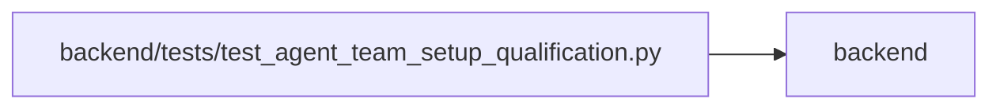

# test_agent_team_setup_qualification Module

**Path:** `backend/tests/test_agent_team_setup_qualification.py`

## Description

Live topology, recovery, redaction, and compatibility qualification.

## Imports

| Source | Symbols |
|--------|---------|
| `__future__` | `annotations` |
| `app.config` | `get_settings` |
| `app.models.agent` | `AgentActor`, `AgentModelBinding`, `AgentModelCatalogEntry`, `AgentRun`, `AgentTeamApplyRun`, `AgentTeamTopology`, `AgentTaskAssignment` |
| `app.schemas.agent` | `AgentRecoveryRequeue`, `AgentTaskAssignmentCreate` |
| `app.schemas.agent_planning` | `AgentPlanningCommandContext` |
| `app.schemas.agent_team_setup` | `ROLE_SCOPE_PRESETS`, `AgentTeamApplyRequest`, `AgentTeamMaster`, `AgentTeamManifestRequest`, `AgentTeamPlanRequest`, `AgentTeamRuntimeAcknowledgement` |
| `app.services.agent_routing_service` | `AgentRoutingConflictError` |
| `app.services.agent_service` | `AgentService`, `hash_api_key` |
| `app.services.agent_team_setup_service` | `AgentTeamSetupConflictError`, `AgentTeamSetupService` |
| `app.services.agent_work_service` | `AgentWorkService` |
| `copy` | `deepcopy` |
| `dataclasses` | `dataclass` |
| `datetime` | `UTC`, `date`, `datetime` |
| `json` | `json` |
| `pathlib` | `Path` |
| `pydantic` | `ValidationError` |
| `pytest` | `pytest` |
| `sqlalchemy` | `func`, `select` |
| `sqlalchemy.ext.asyncio` | `AsyncSession` |
| `sqlalchemy.orm` | `selectinload` |
| `tests.support.transactions` | `reload_session_fixture` |
| `tests.test_agent_routing_wave6_qualification` | `Candidate`, `ScenarioBase`, `_TASK_BRIEF`, `_assessment_command`, `_create_assessment_with_parity`, `_dispatch`, `_exclusion`, `_preview_with_parity` |
| `tests.test_agent_team_setup` | `CapturingCredentialSink`, `example_payload`, `operator` |
| `typing` | `Any` |

## Local dependency map

<!-- Auto-generated local dependency summary. Do not edit by hand. -->

> Module-level dependencies exceed the generated-diagram limits, so the diagram and table below group them by top-level package. Counts report the number of module neighbors in each package.

### Internal neighbors

| Direction | Module |
|---|---|
| Outbound | `backend` (12) |

### External packages

| Language | Used packages | Undeclared packages |
|---|---:|---:|
| python | 3 | 1 |

> All 12 module neighbor(s) are summarized by package because the module-level view exceeds the 12-node limit.

## Classes

| Class | Line | Bases | Description |
|-------|------|-------|-------------|
| [ReadyTopology](../entities/ReadyTopology.md) | 330 | — | — |

## Functions

| Function | Signature | Decorators | Description |
|----------|-----------|------------|-------------|
| `fixed_qualification_clock` | `(monkeypatch: pytest.MonkeyPatch) -> None` | `@pytest.fixture(autouse=True)` | Keep REST/MCP preview parity and readiness freshness deterministic. |
| `topology_payload` | `(*, two_workers: bool = True, include_verifier: bool = True, prefix: str \| None = None) -> dict[str, Any]` | — | Return a logical topology with routine and advanced execution actors. |
| `topology_manifest` | `(**kwargs: Any) -> AgentTeamMaster` | — | — |
| `seed_model_catalog` | *(async)* `(db: AsyncSession, manifest: AgentTeamMaster) -> None` | — | — |
| `apply_manifest` | *(async)* `(service: AgentTeamSetupService, manifest: AgentTeamMaster, *, expected_revision: int, key: str, confirm_required: bool = False)` | — | — |
| `acknowledge_member` | *(async)* `(service: AgentTeamSetupService, *, topology_key: str, actor_key: str, api_key: str) -> None` | — | — |
| `acknowledge_all` | *(async)* `(service: AgentTeamSetupService, manifest: AgentTeamMaster, keys: dict[str, str]) -> None` | — | — |
| `topology_actors` | *(async)* `(db: AsyncSession, manifest: AgentTeamMaster) -> dict[str, AgentActor]` | — | — |
| `default_candidate` | `(actor: AgentActor) -> Candidate` | — | — |
| `provision_ready_topology` | *(async)* `(db: AsyncSession, *, two_workers: bool = True, prefix: str \| None = None) -> ReadyTopology` | — | — |
| `routing_base` | *(async)* `(db: AsyncSession, *, topology: ReadyTopology, actor_key: str, team_member_factory: Any, task_factory: Any, title: str, skill_key: str = 'backend-python', iteration: Any = None) -> ScenarioBase` | — | — |
| `test_setup_scenarios_01_02_fresh_multi_worker_and_noop_reapply` | *(async)* `(db_session: AsyncSession) -> None` | `@pytest.mark.asyncio` | — |
| `test_setup_scenario_03_runtime_handoff_failure_resumes_in_place` | *(async)* `(db_session: AsyncSession) -> None` | `@pytest.mark.asyncio` | — |
| `test_setup_scenario_04_adopts_without_credential_rotation` | *(async)* `(db_session: AsyncSession) -> None` | `@pytest.mark.asyncio` | — |
| `test_setup_scenarios_05_07_08_drift_readiness_and_redaction` | *(async)* `(db_session: AsyncSession) -> None` | `@pytest.mark.asyncio` | — |
| `test_setup_scenario_06_add_binding_change_and_explicit_disable` | *(async)* `(db_session: AsyncSession) -> None` | `@pytest.mark.asyncio` | — |
| `test_setup_scenario_09_live_roster_and_routing_matrix_is_topology_bound` | *(async)* `(db_session: AsyncSession, actor_factory, team_member_factory, task_factory) -> None` | `@pytest.mark.asyncio` | — |
| `test_setup_scenario_10_feature_off_preserves_setup_and_work_evidence` | *(async)* `(db_session: AsyncSession, team_member_factory, task_factory, monkeypatch: pytest.MonkeyPatch) -> None` | `@pytest.mark.asyncio` | — |
| `test_setup_scenario_11_compatibility_preflight_is_non_mutating` | *(async)* `(db_session: AsyncSession, monkeypatch: pytest.MonkeyPatch) -> None` | `@pytest.mark.asyncio` | — |
| `test_setup_scenario_12_revision_and_cross_topology_paths_fail_closed` | *(async)* `(db_session: AsyncSession, actor_factory, team_member_factory, task_factory, monkeypatch: pytest.MonkeyPatch) -> None` | `@pytest.mark.asyncio` | — |
