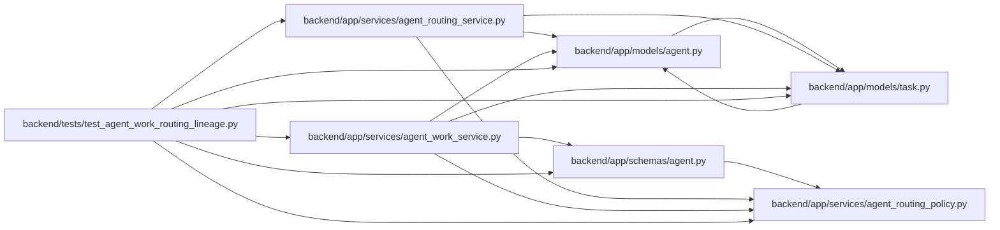

# test_agent_work_routing_lineage Module

**Path:** `backend/tests/test_agent_work_routing_lineage.py`

## Description

Focused assignment/run evidence tests that do not require a database.

## Imports

| Source | Symbols |
|--------|---------|
| `app.models.agent` | `AgentRun`, `AgentTaskAssignment` |
| `app.models.task` | `Task` |
| `app.schemas.agent` | `ModelAwareAgentTaskAssignmentCreate`, `ModelAwareAgentWorkBegin` |
| `app.services.agent_routing_policy` | `canonical_routing_json_bytes` |
| `app.services.agent_routing_service` | `AgentRoutingConflictError`, `AgentRoutingService` |
| `app.services.agent_work_service` | `AgentWorkService` |
| `datetime` | `UTC`, `datetime` |
| `hashlib` | `hashlib` |
| `json` | `json` |
| `pydantic` | `ValidationError` |
| `pytest` | `pytest` |

## Local dependency map

<!-- Auto-generated local dependency summary. Do not edit by hand. -->

### Internal neighbors

| Direction | Module |
|---|---|
| Outbound | [models_agent](../modules/models_agent.md) |
| Outbound | [models_task](../modules/models_task.md) |
| Outbound | [schemas_agent](../modules/schemas_agent.md) |
| Outbound | [agent_routing_policy](../modules/agent_routing_policy.md) |
| Outbound | [agent_routing_service](../modules/agent_routing_service.md) |
| Outbound | [agent_work_service](../modules/agent_work_service.md) |

### External packages

| Language | Used packages | Undeclared packages |
|---|---:|---:|
| python | 2 | 1 |

## Functions

| Function | Signature | Decorators | Description |
|----------|-----------|------------|-------------|
| `_assignment` | `(*, assignment_id: int, snapshot: dict[str, object], reviewer_profile_id: int \| None = None) -> AgentTaskAssignment` | — | — |
| `test_model_aware_commands_own_selection_and_observed_model_fields` | `() -> None` | `@pytest.mark.contract` | — |
| `test_lineage_snapshot_preserves_decision_and_review_floor_without_escalating` | `() -> None` | `@pytest.mark.contract` | — |
| `test_lineage_failure_classification_is_conservative_and_bounded` | `() -> None` | `@pytest.mark.contract` | — |
| `test_completed_rework_selection_retains_lineage_and_governs_escalation` | `() -> None` | `@pytest.mark.contract` | — |
| `test_run_response_keeps_legacy_model_evidence_explicit` | `(model: str \| None, trust_state: str) -> None` | `@pytest.mark.contract`, `@pytest.mark.parametrize(('model', 'trust_state'), [(None, 'unreported'), ('legacy-model', 'unverifiable')])` | — |
