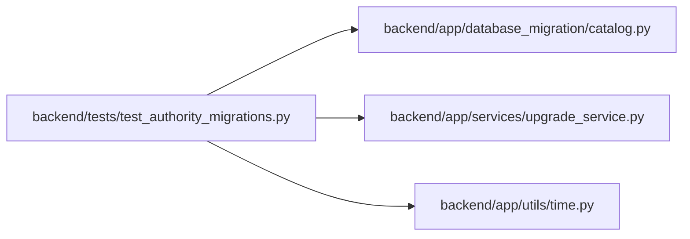

# test_authority_migrations Module

**Path:** `backend/tests/test_authority_migrations.py`

## Description

Additive authority upgrades preserve legacy attribution and empty transfer targets.

## Imports

| Source | Symbols |
|--------|---------|
| `alembic` | `command` |
| `app.database_migration.catalog` | `transfer_tables` |
| `app.services.upgrade_service` | `alembic_config` |
| `app.utils.time` | `utc_now` |
| `datetime` | `date`, `timedelta` |
| `pytest` | `pytest` |
| `sqlalchemy` | `MetaData`, `create_engine`, `event`, `inspect`, `select`, `text` |
| `sqlalchemy.engine` | `make_url` |
| `sqlalchemy.exc` | `IntegrityError` |

## Local dependency map

<!-- Auto-generated local dependency summary. Do not edit by hand. -->

### Internal neighbors

| Direction | Module |
|---|---|
| Outbound | [catalog](../modules/catalog.md) |
| Outbound | [upgrade_service](../modules/upgrade_service.md) |
| Outbound | [time](../modules/time.md) |

### External packages

| Language | Used packages | Undeclared packages |
|---|---:|---:|
| python | 3 | 1 |

## Functions

| Function | Signature | Decorators | Description |
|----------|-----------|------------|-------------|
| `legacy_authority_database` | `(request, tmp_path, configure_database)` | `@pytest.fixture(params=[pytest.param('sqlite', marks=pytest.mark.sqlite), pytest.param('postgresql', marks=[pytest.mark.postgresql, pytest.mark.allow_network])])` | — |
| `test_authority_upgrade_preserves_guest_ids_and_does_not_invent_humans` | `(legacy_authority_database)` | — | — |
| `test_schema_only_target_remains_empty_for_catalogued_transfer` | `(legacy_authority_database)` | — | — |
| `test_new_foreign_keys_and_uniqueness_are_declared` | `(legacy_authority_database)` | — | — |
