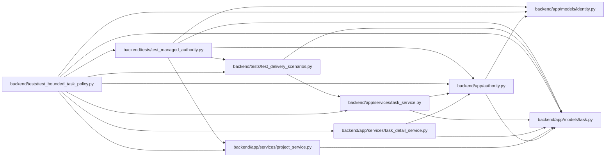

# test_bounded_task_policy Module

**Path:** `backend/tests/test_bounded_task_policy.py`

## Description

Nested UI detail observes inherited policy without loading an execution graph.

## Imports

| Source | Symbols |
|--------|---------|
| `app.authority` | `Authority`, `AuthorityError` |
| `app.models.identity` | `CommandAudit` |
| `app.models.task` | `Task` |
| `app.services.project_service` | `ProjectService` |
| `app.services.task_detail_service` | `TaskDetailService` |
| `app.services.task_service` | `TaskService` |
| `pytest` | `pytest` |
| `sqlalchemy` | `func`, `select` |
| `tests.test_delivery_scenarios` | `delivery_store` |
| `tests.test_managed_authority` | `managed_store` |

## Local dependency map

<!-- Auto-generated local dependency summary. Do not edit by hand. -->

### Internal neighbors

| Direction | Module |
|---|---|
| Outbound | [authority](../modules/authority.md) |
| Outbound | [models_identity](../modules/models_identity.md) |
| Outbound | [models_task](../modules/models_task.md) |
| Outbound | [project_service](../modules/project_service.md) |
| Outbound | [task_detail_service](../modules/task_detail_service.md) |
| Outbound | [task_service](../modules/task_service.md) |
| Outbound | [test_delivery_scenarios](../modules/test_delivery_scenarios.md) |
| Outbound | [test_managed_authority](../modules/test_managed_authority.md) |

### External packages

| Language | Used packages | Undeclared packages |
|---|---:|---:|
| python | 2 | 1 |

## Functions

| Function | Signature | Decorators | Description |
|----------|-----------|------------|-------------|
| `test_nested_detail_returns_current_flags_without_graph_hydration` | *(async)* `(delivery_store)` | — | — |
| `test_deep_policy_is_complete_while_displayed_ancestry_remains_bounded` | *(async)* `(delivery_store)` | — | — |
| `test_hidden_parent_policy_cannot_disclose_private_scope` | *(async)* `(managed_store)` | — | — |
| `test_project_tree_serialization_preserves_loaded_parent_policy` | *(async)* `(delivery_store)` | — | — |
