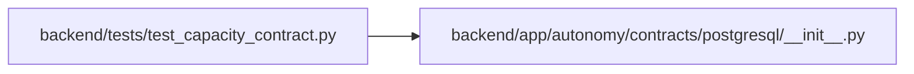

# test_capacity_contract Module

**Path:** `backend/tests/test_capacity_contract.py`

## Description

Executable checks for the approved PostgreSQL capacity contract.

## Imports

| Source | Symbols |
|--------|---------|
| `__future__` | `annotations` |
| `app.autonomy.contracts.postgresql` | `PostgreSQLContractBundle`, `load_postgresql_contract_bundle` |
| `pytest` | `pytest` |

## Local dependency map

<!-- Auto-generated local dependency summary. Do not edit by hand. -->

### Internal neighbors

| Direction | Module |
|---|---|
| Outbound | [postgresql___init__](../modules/postgresql___init__.md) |

### External packages

| Language | Used packages | Undeclared packages |
|---|---:|---:|
| python | 1 | 1 |

## Functions

| Function | Signature | Decorators | Description |
|----------|-----------|------------|-------------|
| `postgresql_contract_bundle` | `() -> PostgreSQLContractBundle` | `@pytest.fixture(scope='module')` | — |
| `capacity_contract` | `(postgresql_contract_bundle: PostgreSQLContractBundle) -> dict` | `@pytest.fixture(scope='module')` | — |
| `test_database_contract_is_frozen` | `(capacity_contract: dict) -> None` | `@pytest.mark.contract` | — |
| `test_connection_budget_preserves_required_reserve` | `(capacity_contract: dict) -> None` | `@pytest.mark.contract` | — |
| `test_identity_claim_cannot_be_read_as_authenticated_people` | `(capacity_contract: dict) -> None` | `@pytest.mark.contract` | — |
| `test_operation_manifests_have_exact_weights_and_shapes` | `(capacity_contract: dict, profile_id: str, read_weight: int, write_weight: int) -> None` | `@pytest.mark.contract`, `@pytest.mark.parametrize(('profile_id', 'read_weight', 'write_weight'), [('human_peak_v1', 80, 20), ('mixed_peak_v1', 59, 41)])` | — |
| `test_surge_and_external_wait_are_explicit` | `(capacity_contract: dict) -> None` | `@pytest.mark.contract` | — |
| `test_every_later_database_task_is_in_the_packaged_trace` | `(postgresql_contract_bundle: PostgreSQLContractBundle) -> None` | `@pytest.mark.contract` | — |
