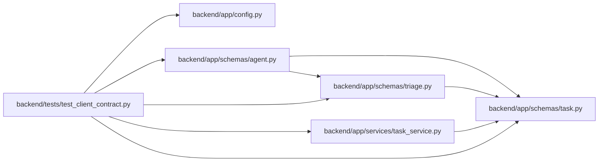

# test_client_contract Module

**Path:** `backend/tests/test_client_contract.py`

## Description

Schema-derived compatibility, legacy payloads, and additive client behavior.

## Imports

| Source | Symbols |
|--------|---------|
| `app.config` | `Settings` |
| `app.schemas.agent` | `AgentActorCreate` |
| `app.schemas.task` | `TaskStatusChange`, `TaskUpdate` |
| `app.schemas.triage` | `TriageConvertToTaskRequest` |
| `app.services.task_service` | `TaskVersionConflictError` |
| `json` | `json` |
| `pathlib` | `Path` |
| `pydantic` | `ValidationError` |
| `pytest` | `pytest` |
| `runpy` | `runpy` |

## Local dependency map

<!-- Auto-generated local dependency summary. Do not edit by hand. -->

### Internal neighbors

| Direction | Module |
|---|---|
| Outbound | [config](../modules/config.md) |
| Outbound | [schemas_agent](../modules/schemas_agent.md) |
| Outbound | [schemas_task](../modules/schemas_task.md) |
| Outbound | [schemas_triage](../modules/schemas_triage.md) |
| Outbound | [task_service](../modules/task_service.md) |

### External packages

| Language | Used packages | Undeclared packages |
|---|---:|---:|
| python | 2 | 1 |

## Functions

| Function | Signature | Decorators | Description |
|----------|-----------|------------|-------------|
| `test_client_contract_is_current_and_deterministic` | `()` | — | — |
| `test_supported_task_update_payloads` | `(payload)` | `@pytest.mark.parametrize('payload', [{'title': 'Legacy edit'}, {'title': 'Versioned edit', 'expected_version': 2}])` | — |
| `test_legacy_triage_target_and_additive_brief_input` | `()` | — | — |
| `test_unknown_actions_and_invalid_versions_do_not_succeed` | `()` | — | — |
| `test_conflict_fixture_uses_the_server_machine_code` | `()` | — | — |
| `test_public_skill_bundles_require_the_trusted_checksum` | `()` | — | — |
| `test_actor_provisioning_does_not_require_or_invent_runtime_binding` | `()` | — | — |
