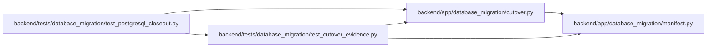

# test_cutover_evidence Module

**Path:** `backend/tests/database_migration/test_cutover_evidence.py`

## Description

Fail-closed contracts for rehearsal and production cutover evidence.

## Imports

| Source | Symbols |
|--------|---------|
| `__future__` | `annotations` |
| `app.database_migration.cutover` | `CAPACITY_CLAIM`, `DOCUMENTATION_CHECKS`, `GATE_IDS`, `GATE_OWNER_ROLES`, `QUALIFICATION_ATTESTATION`, `QUALIFICATION_GATES`, `CutoverEvidenceError`, `_sign_document`, `attest_documentation`, `authorize_production`, `finalize_production`, `finalize_rehearsal`, `finalize_rehearsal_series`, `seal_execution`, `verify_report`, `verify_signed_document` |
| `app.database_migration.manifest` | `canonical_json_bytes`, `read_document`, `sha256_bytes`, `write_document` |
| `cryptography.hazmat.primitives` | `serialization` |
| `cryptography.hazmat.primitives.asymmetric.ed25519` | `Ed25519PrivateKey` |
| `datetime` | `UTC`, `datetime`, `timedelta` |
| `json` | `json` |
| `jsonschema` | `Draft202012Validator`, `FormatChecker` |
| `pathlib` | `Path` |
| `pytest` | `pytest` |
| `tomllib` | `tomllib` |

## Local dependency map

<!-- Auto-generated local dependency summary. Do not edit by hand. -->

### Internal neighbors

| Direction | Module |
|---|---|
| Inbound | [test_postgresql_closeout](../modules/test_postgresql_closeout.md) |
| Outbound | [database_migration_cutover](../modules/database_migration_cutover.md) |
| Outbound | [database_migration_manifest](../modules/database_migration_manifest.md) |

### External packages

| Language | Used packages | Undeclared packages |
|---|---:|---:|
| python | 3 | 2 |

## Functions

| Function | Signature | Decorators | Description |
|----------|-----------|------------|-------------|
| `_key_pair` | `(directory: Path, name: str) -> tuple[Path, Path]` | — | — |
| `test_zero_human_mode_rejects_file_signing_and_file_trust` | `(tmp_path: Path, monkeypatch: pytest.MonkeyPatch) -> None` | — | — |
| `_timestamp` | `(value: datetime) -> str` | — | — |
| `_release` | `(tmp_path: Path) -> dict` | — | — |
| `_release_reference` | `(release: dict) -> dict` | — | — |
| `_qualification` | `(tmp_path: Path, release: dict, private_key: Path) -> dict` | — | — |
| `_documentation` | `(tmp_path: Path, release: dict, private_key: Path) -> dict` | — | — |
| `_source` | `(seed: str) -> dict` | — | — |
| `_target` | `() -> dict` | — | — |
| `_operators` | `() -> dict` | — | — |
| `_execution` | `(*, release: dict, qualification: dict, documentation: dict, base: datetime, mode: str, sequence: int, source_seed: str, environment: str = 'rehearsal', authorization_sha256: str \| None = None) -> dict` | — | — |
| `_write_raw` | `(path: Path, payload: dict) -> None` | — | — |
| `_trusted_inputs` | `(tmp_path: Path) -> dict` | — | — |
| `_finalize_one_rehearsal` | `(tmp_path: Path, trusted: dict, execution: dict, name: str) -> dict` | — | — |
| `test_abort_two_rehearsals_and_production_cutover_are_cryptographically_bound` | `(tmp_path: Path) -> None` | — | — |
| `test_execution_refuses_manual_steps_hard_stop_and_secret_material` | `(tmp_path: Path) -> None` | — | — |
| `test_trusted_key_pin_and_abort_drill_are_mandatory` | `(tmp_path: Path) -> None` | — | — |
| `test_execution_schema_and_installed_entrypoint_match_runtime_contract` | `(tmp_path: Path) -> None` | — | — |
