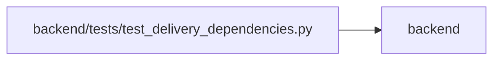

# test_delivery_dependencies Module

**Path:** `backend/tests/test_delivery_dependencies.py`

## Description

Cross-project readiness, cycle prevention and retained acceptance history.

## Imports

| Source | Symbols |
|--------|---------|
| `app.authority` | `Authority` |
| `app.commands` | `PlanningConflict` |
| `app.models.delivery_dependency` | `DeliveryDependency` |
| `app.models.identity` | `Principal` |
| `app.models.project` | `ProjectMilestone` |
| `app.models.task` | `Task` |
| `app.schemas.task` | `TaskCreate` |
| `app.schemas.task_domain` | `TaskActionRequest` |
| `app.services.delivery_dependency_service` | `DeliveryDependencyService` |
| `app.services.task_domain_service` | `TaskDomainService` |
| `app.services.task_service` | `TaskService` |
| `app.utils.time` | `utc_now` |
| `datetime` | `date` |
| `pytest` | `pytest` |
| `sqlalchemy` | `select` |
| `tests.test_delivery_scenarios` | `delivery_store` |

## Local dependency map

<!-- Auto-generated local dependency summary. Do not edit by hand. -->

> Module-level dependencies exceed the generated-diagram limits, so the diagram and table below group them by top-level package. Counts report the number of module neighbors in each package.

### Internal neighbors

| Direction | Module |
|---|---|
| Outbound | `backend` (13) |

### External packages

| Language | Used packages | Undeclared packages |
|---|---:|---:|
| python | 2 | 1 |

> All 13 module neighbor(s) are summarized by package because the module-level view exceeds the 12-node limit.

## Functions

| Function | Signature | Decorators | Description |
|----------|-----------|------------|-------------|
| `pair` | *(async)* `(db, scenario)` | — | — |
| `test_dependency_requires_current_acceptance_and_blocks_manual_start` | *(async)* `(delivery_store)` | — | — |
| `test_global_cycle_and_referenced_delete_roll_back` | *(async)* `(delivery_store)` | — | — |
| `test_target_revocation_redacts_identity_and_denies_new_edges` | *(async)* `(delivery_store)` | — | — |
| `test_milestone_target_and_own_milestone_cycle` | *(async)* `(delivery_store)` | — | — |
