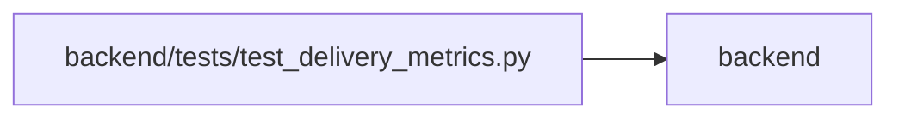

# test_delivery_metrics Module

**Path:** `backend/tests/test_delivery_metrics.py`

## Description

Recorded workflow instants, durable scope and missing history stay distinct.

## Imports

| Source | Symbols |
|--------|---------|
| `app.authority` | `Authority`, `AuthorityError` |
| `app.commands` | `command_transaction` |
| `app.models.delivery_observation` | `DeliveryObservation` |
| `app.models.recovery` | `TaskDeletionFence` |
| `app.models.task` | `Task` |
| `app.query_limits` | `CollectionLimitExceededError` |
| `app.schemas.task` | `TaskCreate` |
| `app.schemas.task_brief` | `BriefCriterion`, `CriterionProgress`, `ProgressWrite`, `TaskBrief`, `TaskReviewWrite` |
| `app.schemas.task_domain` | `TaskActionRequest` |
| `app.services` | `delivery_metrics_service` |
| `app.services.delivery_metrics_service` | `DeliveryMetricsService`, `summarize_observations` |
| `app.services.task_brief_service` | `TaskBriefService` |
| `app.services.task_domain_service` | `TaskDomainService` |
| `app.services.task_service` | `TaskService` |
| `datetime` | `UTC`, `datetime`, `timedelta` |
| `pytest` | `pytest` |
| `sqlalchemy` | `func`, `select` |
| `tests.test_delivery_scenarios` | `delivery_store` |
| `tests.test_task_domain` | `human_context` |
| `types` | `SimpleNamespace` |

## Local dependency map

<!-- Auto-generated local dependency summary. Do not edit by hand. -->

> Module-level dependencies exceed the generated-diagram limits, so the diagram and table below group them by top-level package. Counts report the number of module neighbors in each package.

### Internal neighbors

| Direction | Module |
|---|---|
| Outbound | `backend` (15) |

### External packages

| Language | Used packages | Undeclared packages |
|---|---:|---:|
| python | 2 | 1 |

> All 15 module neighbor(s) are summarized by package because the module-level view exceeds the 12-node limit.

## Functions

| Function | Signature | Decorators | Description |
|----------|-----------|------------|-------------|
| `test_duration_samples_use_events_and_keep_unknown_and_censored_histories` | `()` | — | — |
| `accepted_work` | *(async)* `(factory, scenario)` | — | — |
| `test_observations_survive_hierarchy_moves_reopen_and_deletion` | *(async)* `(delivery_store)` | — | — |
| `test_scope_at_event_and_permission_isolation_are_preserved` | *(async)* `(delivery_store)` | — | — |
| `test_observation_rollback_and_unknown_legacy_dates` | *(async)* `(delivery_store)` | — | — |
| `test_ledger_is_immutable_and_restoration_does_not_create_capture_history` | *(async)* `(delivery_store)` | — | — |
| `test_window_report_ignores_large_completed_history_and_seeds_episodes` | *(async)* `(delivery_store, monkeypatch)` | — | — |
| `test_pre_window_seeds_keep_scope_boundaries_and_unknown_histories` | *(async)* `(delivery_store)` | — | — |
