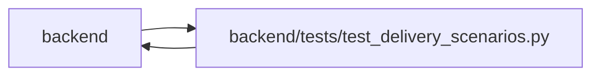

# test_delivery_scenarios Module

**Path:** `backend/tests/test_delivery_scenarios.py`

## Description

Delivery contracts and strict reproductions of unresolved behavior.

## Imports

| Source | Symbols |
|--------|---------|
| `app.commands` | `command_transaction` |
| `app.database` | `Base`, `get_db`, `request_command_mode` |
| `app.main` | `app` |
| `app.models.task` | `Task` |
| `app.models.team_member` | `TeamMember` |
| `app.services` | `snapshot_service`, `task_service` |
| `app.services.agent_service` | `AgentService` |
| `app.services.task_service` | `TaskService` |
| `datetime` | `date` |
| `fastapi` | `Request` |
| `httpx` | `httpx` |
| `pytest` | `pytest` |
| `pytest_asyncio` | `pytest_asyncio` |
| `sqlalchemy` | `select` |
| `sqlalchemy.ext.asyncio` | `async_sessionmaker`, `create_async_engine` |
| `tests.support.delivery` | `seed_delivery_scenario` |

## Local dependency map

<!-- Auto-generated local dependency summary. Do not edit by hand. -->

> Module-level dependencies exceed the generated-diagram limits, so the diagram and table below group them by top-level package. Counts report the number of module neighbors in each package.

### Internal neighbors

| Direction | Module |
|---|---|
| Inbound | `backend` (9) |
| Outbound | `backend` (9) |

### External packages

| Language | Used packages | Undeclared packages |
|---|---:|---:|
| python | 5 | 2 |

> All 18 module neighbor(s) are summarized by package because the module-level view exceeds the 12-node limit.

## Classes

| Class | Line | Bases | Description |
|-------|------|-------|-------------|
| [KnownDeliveryDiscrepancy](../entities/KnownDeliveryDiscrepancy.md) | 23 | `AssertionError` | Only the specific observed behavior may satisfy an expected failure. |

## Functions

| Function | Signature | Decorators | Description |
|----------|-----------|------------|-------------|
| `delivery_store` | *(async)* `(request, sqlite_engine, tmp_path, monkeypatch)` | `@pytest_asyncio.fixture(params=[pytest.param('sqlite', marks=pytest.mark.sqlite), pytest.param('postgresql', marks=[pytest.mark.postgresql, pytest.mark.allow_network])])` | — |
| `test_shared_owner_nested_work_and_independent_actors` | *(async)* `(delivery_store)` | — | — |
| `test_two_editors_reject_stale_write_and_keep_first_value` | *(async)* `(delivery_store)` | — | — |
| `preview_edit` | *(async)* `(scenario)` | — | — |
| `test_preview_rolls_back_database_edits` | *(async)* `(delivery_store)` | — | — |
| `test_preview_leaves_snapshot_storage_unchanged` | *(async)* `(delivery_store)` | — | — |
| `merged_closed_parent` | *(async)* `(delivery_store)` | — | — |
| `test_closed_merge_preserves_leaf_completion` | *(async)* `(delivery_store)` | — | — |
| `test_merge_inherits_most_urgent_leaf_priority` | *(async)* `(delivery_store)` | — | — |
| `test_active_past_end_date_is_overdue` | *(async)* `(delivery_store)` | — | — |
| `test_legacy_triage_missing_iteration_has_field_localized_error` | *(async)* `(delivery_store)` | — | — |
