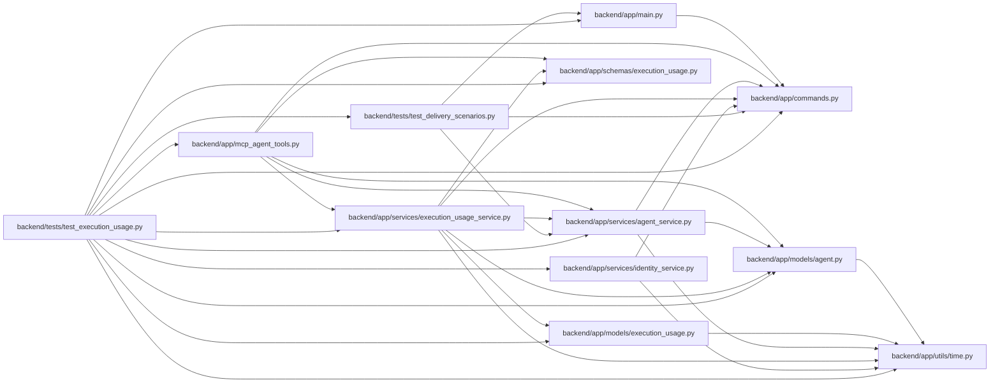

# test_execution_usage Module

**Path:** `backend/tests/test_execution_usage.py`

## Description

Usage provenance, corrections, immutable pricing and permission isolation.

## Imports

| Source | Symbols |
|--------|---------|
| `app` | `mcp_agent_tools` |
| `app.commands` | `command_transaction` |
| `app.main` | `app` |
| `app.models.agent` | `AgentActor`, `AgentRun` |
| `app.models.execution_usage` | `ExecutionUsageRecord` |
| `app.schemas.execution_usage` | `ExecutionUsageWrite`, `UsagePricingBasis` |
| `app.services.agent_service` | `AgentConflictError`, `AgentPermissionError` |
| `app.services.execution_usage_service` | `ExecutionUsageService`, `estimate_cost` |
| `app.services.identity_service` | `IdentityService` |
| `app.utils.time` | `utc_now` |
| `asyncio` | `asyncio` |
| `datetime` | `timedelta` |
| `decimal` | `Decimal` |
| `httpx` | `httpx` |
| `pytest` | `pytest` |
| `sqlalchemy` | `func`, `select` |
| `tests.test_delivery_scenarios` | `delivery_store` |

## Local dependency map

<!-- Auto-generated local dependency summary. Do not edit by hand. -->

### Internal neighbors

| Direction | Module |
|---|---|
| Outbound | [commands](../modules/commands.md) |
| Outbound | [app_main](../modules/app_main.md) |
| Outbound | [mcp_agent_tools](../modules/mcp_agent_tools.md) |
| Outbound | [models_agent](../modules/models_agent.md) |
| Outbound | [models_execution_usage](../modules/models_execution_usage.md) |
| Outbound | [schemas_execution_usage](../modules/schemas_execution_usage.md) |
| Outbound | [agent_service](../modules/agent_service.md) |
| Outbound | [execution_usage_service](../modules/execution_usage_service.md) |
| Outbound | [identity_service](../modules/identity_service.md) |
| Outbound | [time](../modules/time.md) |
| Outbound | [test_delivery_scenarios](../modules/test_delivery_scenarios.md) |

### External packages

| Language | Used packages | Undeclared packages |
|---|---:|---:|
| python | 3 | 1 |

## Functions

| Function | Signature | Decorators | Description |
|----------|-----------|------------|-------------|
| `seed_run` | *(async)* `(factory, scenario)` | — | — |
| `usage` | `(now, **overrides)` | — | — |
| `test_usage_zero_unknown_and_currency_validation` | `()` | — | — |
| `test_usage_replay_correction_and_currency_buckets` | *(async)* `(delivery_store)` | — | — |
| `test_usage_unknown_without_reports_and_foreign_reporter_is_denied` | *(async)* `(delivery_store)` | — | — |
| `test_usage_rest_mcp_parity_and_readonly_human_summary` | *(async)* `(delivery_store)` | — | — |
| `test_reported_zero_and_unknown_are_not_repriced_by_live_metadata` | *(async)* `(delivery_store)` | — | — |
| `test_usage_correction_is_versioned_and_atomic` | *(async)* `(delivery_store)` | — | — |
| `test_concurrent_usage_corrections_reserve_one_head` | *(async)* `(delivery_store)` | — | — |
