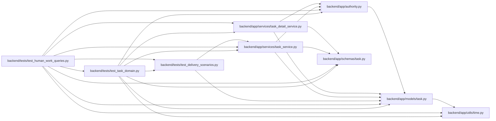

# test_human_work_queries Module

**Path:** `backend/tests/test_human_work_queries.py`

## Description

Human ownership queries and exact-ID lookup respect project visibility.

## Imports

| Source | Symbols |
|--------|---------|
| `app.authority` | `Authority`, `AuthorityError` |
| `app.models.task` | `Task` |
| `app.schemas.task` | `TaskCreate` |
| `app.services.task_detail_service` | `TaskDetailService` |
| `app.services.task_service` | `TaskService` |
| `app.utils.time` | `utc_now` |
| `pytest` | `pytest` |
| `tests.test_delivery_scenarios` | `delivery_store` |
| `tests.test_task_domain` | `human_context` |

## Local dependency map

<!-- Auto-generated local dependency summary. Do not edit by hand. -->

### Internal neighbors

| Direction | Module |
|---|---|
| Outbound | [authority](../modules/authority.md) |
| Outbound | [models_task](../modules/models_task.md) |
| Outbound | [schemas_task](../modules/schemas_task.md) |
| Outbound | [task_detail_service](../modules/task_detail_service.md) |
| Outbound | [task_service](../modules/task_service.md) |
| Outbound | [time](../modules/time.md) |
| Outbound | [test_delivery_scenarios](../modules/test_delivery_scenarios.md) |
| Outbound | [test_task_domain](../modules/test_task_domain.md) |

### External packages

| Language | Used packages | Undeclared packages |
|---|---:|---:|
| python | 1 | 1 |

## Functions

| Function | Signature | Decorators | Description |
|----------|-----------|------------|-------------|
| `test_my_work_includes_nested_and_backlog_without_private_work` | *(async)* `(delivery_store)` | — | — |
| `test_lookup_matches_id_case_and_literal_wildcards_without_private_counts` | *(async)* `(delivery_store)` | — | — |
| `test_withdrawn_acceptance_stays_visible_in_owned_blocked_work` | *(async)* `(delivery_store)` | — | — |
| `test_my_work_filters_before_pagination_and_preserves_scope` | *(async)* `(delivery_store)` | — | — |
