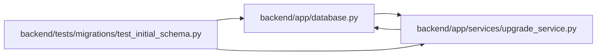

# test_initial_schema Module

**Path:** `backend/tests/migrations/test_initial_schema.py`

## Description

The packaged initial schema and fail-closed development reset boundary.

## Imports

| Source | Symbols |
|--------|---------|
| `alembic` | `command` |
| `alembic.script` | `ScriptDirectory` |
| `app.database` | `Base` |
| `app.services.upgrade_service` | `UpgradeError`, `alembic_config`, `bootstrap_database_schema`, `head_revision`, `inspect_database`, `run_alembic_upgrade` |
| `pathlib` | `Path` |
| `pytest` | `pytest` |
| `sqlalchemy` | `CheckConstraint`, `create_engine`, `text`, `inspect` |

## Local dependency map

<!-- Auto-generated local dependency summary. Do not edit by hand. -->

### Internal neighbors

| Direction | Module |
|---|---|
| Outbound | [app_database](../modules/app_database.md) |
| Outbound | [upgrade_service](../modules/upgrade_service.md) |

### External packages

| Language | Used packages | Undeclared packages |
|---|---:|---:|
| python | 3 | 1 |

## Functions

| Function | Signature | Decorators | Description |
|----------|-----------|------------|-------------|
| `test_initial_schema_is_one_frozen_revision` | `()` | — | — |
| `test_unreleased_databases_are_refused_without_mutation` | `(tmp_path, configure_database, revision)` | `@pytest.mark.sqlite`, `@pytest.mark.parametrize('revision', ['20260506_0000', '20260916_0039', None])` | — |
| `test_current_upgrade_is_idempotent_and_downgrade_is_refused` | `(tmp_path, configure_database)` | `@pytest.mark.sqlite` | — |
| `test_current_bootstrap_keeps_model_foreign_keys_and_checks` | `(tmp_path, configure_database)` | `@pytest.mark.sqlite` | — |
