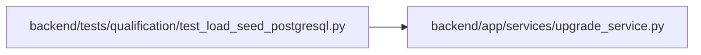

# test_load_seed_postgresql Module

**Path:** `backend/tests/qualification/test_load_seed_postgresql.py`

## Description

Real-PostgreSQL small seed and resumability qualification.

## Imports

| Source | Symbols |
|--------|---------|
| `__future__` | `annotations` |
| `app.services.upgrade_service` | `bootstrap_database_schema` |
| `argparse` | `Namespace` |
| `httpx` | `httpx` |
| `os` | `os` |
| `pathlib` | `Path` |
| `pytest` | `pytest` |
| `scripts.load.common` | `atomic_write_json`, `read_json_object`, `utc_now_text` |
| `scripts.load.finalize` | `finalize_result` |
| `scripts.load.seed` | `_target_identifier`, `seed_database` |
| `socket` | `socket` |
| `subprocess` | `subprocess` |
| `sys` | `sys` |
| `time` | `time` |

## Local dependency map

<!-- Auto-generated local dependency summary. Do not edit by hand. -->

### Internal neighbors

| Direction | Module |
|---|---|
| Outbound | [upgrade_service](../modules/upgrade_service.md) |

### External packages

| Language | Used packages | Undeclared packages |
|---|---:|---:|
| python | 3 | 2 |

## Functions

| Function | Signature | Decorators | Description |
|----------|-----------|------------|-------------|
| `test_small_postgresql_seed_is_exact_and_resumable` | `(postgres_database, configure_database, tmp_path: Path) -> None` | `@pytest.mark.postgresql`, `@pytest.mark.integration`, `@pytest.mark.allow_network` | — |
