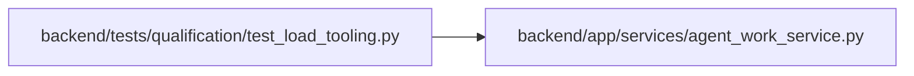

# test_load_tooling Module

**Path:** `backend/tests/qualification/test_load_tooling.py`

## Description

Unit contracts for deterministic, sealed, fail-closed load tooling.

## Imports

| Source | Symbols |
|--------|---------|
| `__future__` | `annotations` |
| `app.services.agent_work_service` | `AGENT_BUSY_POLL_SECONDS`, `AGENT_IDLE_POLL_SECONDS`, `AGENT_RETRY_MAX_SECONDS` |
| `argparse` | `Namespace` |
| `collections` | `Counter` |
| `cryptography.hazmat.primitives` | `serialization` |
| `cryptography.hazmat.primitives.asymmetric.ed25519` | `Ed25519PrivateKey` |
| `datetime` | `UTC`, `datetime`, `timedelta` |
| `pathlib` | `Path` |
| `pytest` | `pytest` |
| `scripts.load.collect` | `_derive` |
| `scripts.load.common` | `DATA_LIFECYCLE_POLICY_MEMBER`, `QualificationInputError`, `atomic_write_json`, `authorized_base_url`, `capacity_contract`, `contract_member_sha256`, `contract_sha256`, `read_json_object`, `traffic_profile` |
| `scripts.load.qualify` | `REQUIRED_RESULTS`, `RUN_GATES`, `_finalize`, `_fingerprint`, `_verify_report` |
| `scripts.load.resilience` | `evaluate` |
| `scripts.load.run` | `OperationBuilder`, `_retry_delay_seconds`, `_select_browser_credentials`, `_update_agent_state`, `_validated_retry_policy`, `_weighted_plan` |
| `scripts.load.seed` | `_dry_manifest`, `_session_rows`, `_validate_target` |
| `sys` | `sys` |

## Local dependency map

<!-- Auto-generated local dependency summary. Do not edit by hand. -->

### Internal neighbors

| Direction | Module |
|---|---|
| Outbound | [agent_work_service](../modules/agent_work_service.md) |

### External packages

| Language | Used packages | Undeclared packages |
|---|---:|---:|
| python | 3 | 2 |

## Functions

| Function | Signature | Decorators | Description |
|----------|-----------|------------|-------------|
| `test_load_target_and_seed_safety_fences_fail_closed` | `(monkeypatch: pytest.MonkeyPatch) -> None` | — | — |
| `test_zero_human_mode_rejects_legacy_qualification_trust` | `(monkeypatch: pytest.MonkeyPatch) -> None` | — | — |
| `test_weight_plan_and_browser_state_selection_are_deterministic` | `() -> None` | — | — |
| `test_runtime_agent_poll_guidance_matches_capacity_contract` | `() -> None` | — | — |
| `test_connection_surge_retry_policy_is_bounded_and_deterministic` | `() -> None` | — | — |
| `test_agent_client_tracks_server_selected_assignment_and_live_fence` | `() -> None` | — | — |
| `test_seed_dry_manifest_is_sealed_and_reproducible` | `(tmp_path: Path) -> None` | — | — |
| `_timestamp` | `(offset_seconds: int) -> str` | — | — |
| `test_resilience_observations_derive_all_fault_metrics` | `(tmp_path: Path) -> None` | — | — |
| `_snapshot` | `(path: Path, *, created_at: str, size: int, wal: int, deadlocks: int, table_size: int) -> dict` | — | — |
| `test_snapshot_derivation_projects_capacity_only_from_eight_hour_sample` | `(tmp_path: Path) -> None` | — | — |
| `test_final_report_requires_and_verifies_ed25519_signature` | `(tmp_path: Path) -> None` | — | — |
