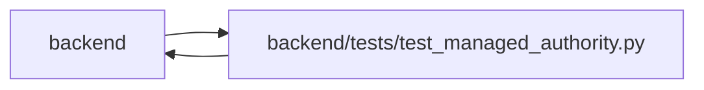

# test_managed_authority Module

**Path:** `backend/tests/test_managed_authority.py`

## Description

Real principal, transport, scoped-read and command-denial contracts.

## Imports

| Source | Symbols |
|--------|---------|
| `app.authority` | `AuthorityError`, `Authority`, `AuthorityError` |
| `app.commands` | `command_transaction` |
| `app.config` | `get_settings` |
| `app.main` | `app` |
| `app.models.agent` | `AgentTaskAssignment` |
| `app.models.identity` | `Principal`, `IdentitySubject`, `ProjectMembership`, `WorkspaceMembership`, `WorkspaceAuthorityState`, `CommandAudit`, `CommandAudit`, `CommandAudit`, `CommandAudit`, `CommandAudit` |
| `app.models.outbound_webhook` | `OutboundWebhookEvent`, `OutboundWebhookEvent`, `OutboundWebhookEvent` |
| `app.models.project` | `Project`, `Project`, `Project`, `Project`, `Project`, `Project` |
| `app.models.recovery` | `ApplicationSnapshot` |
| `app.models.saved_view` | `SavedView` |
| `app.models.task` | `Task` |
| `app.models.user_session` | `UserSession` |
| `app.services` | `project_service` |
| `app.services.identity_service` | `digest`, `validate_id_token` |
| `app.utils.time` | `utc_now` |
| `cryptography.hazmat.primitives.asymmetric` | `rsa` |
| `datetime` | `timedelta` |
| `httpx` | `httpx` |
| `json` | `json` |
| `jwt` | `jwt` |
| `pytest` | `pytest` |
| `pytest_asyncio` | `pytest_asyncio` |
| `sqlalchemy` | `func`, `select`, `update`, `event` |
| `sqlalchemy.exc` | `IntegrityError` |
| `sqlalchemy.ext.asyncio` | `AsyncSession` |
| `tests.test_delivery_scenarios` | `delivery_store` |

## Local dependency map

<!-- Auto-generated local dependency summary. Do not edit by hand. -->

> Module-level dependencies exceed the generated-diagram limits, so the diagram and table below group them by top-level package. Counts report the number of module neighbors in each package.

### Internal neighbors

| Direction | Module |
|---|---|
| Inbound | `backend` (8) |
| Outbound | `backend` (16) |

### External packages

| Language | Used packages | Undeclared packages |
|---|---:|---:|
| python | 6 | 2 |

> All 24 module neighbor(s) are summarized by package because the module-level view exceeds the 12-node limit.

## Functions

| Function | Signature | Decorators | Description |
|----------|-----------|------------|-------------|
| `managed_store` | *(async)* `(delivery_store, monkeypatch)` | `@pytest_asyncio.fixture` | — |
| `client` | `(token = None, **headers)` | — | — |
| `test_workspace_owner_deletes_empty_project_with_retained_audit` | *(async)* `(managed_store)` | — | — |
| `create_empty_project_as_owner` | *(async)* `(managed_store)` | — | — |
| `test_project_deletion_has_one_attributable_audit_and_outbox_outcome` | *(async)* `(managed_store, credential)` | `@pytest.mark.parametrize('credential', ['owner', 'operator'])` | — |
| `test_scoped_nonmanager_deletion_is_denied_without_domain_changes` | *(async)* `(managed_store, role)` | `@pytest.mark.parametrize('role', ['viewer', 'editor', 'executor', 'reviewer'])` | — |
| `test_project_delete_failures_roll_back_domain_audit_and_outbox` | *(async)* `(managed_store, monkeypatch, failure_point)` | `@pytest.mark.parametrize('failure_point', ['before_delete', 'outbox', 'after_outbox', 'audit'])` | — |
| `test_command_audit_details_cannot_be_rewritten` | *(async)* `(managed_store)` | — | — |
| `test_project_deletion_refuses_live_assignment_scope_without_partial_detach` | *(async)* `(managed_store, state)` | `@pytest.mark.parametrize('state', ['queued', 'accepted'])` | — |
| `test_managed_mode_rejects_missing_forged_and_conflicting_identity` | *(async)* `(managed_store)` | — | — |
| `test_project_reads_hide_unrelated_ids_counts_and_people` | *(async)* `(managed_store)` | — | — |
| `test_cookie_mutations_require_request_integrity` | *(async)* `(managed_store)` | — | — |
| `test_execution_actor_cannot_accept_via_ordinary_status_route` | *(async)* `(managed_store)` | — | — |
| `test_viewer_cannot_reorder_via_bulk_sql` | *(async)* `(managed_store)` | — | — |
| `test_guest_transfer_requires_token_and_preserves_original_attribution` | *(async)* `(managed_store)` | — | — |
| `test_logout_revokes_bearer_and_cookie_access` | *(async)* `(managed_store)` | — | — |
| `test_issuer_subject_unique_without_name_or_ip_identity` | *(async)* `(managed_store)` | — | — |
| `test_oidc_signature_nonce_issuer_audience_and_expiry` | `(monkeypatch)` | — | — |
| `test_viewer_denials_cover_alternate_commands_and_private_reads` | *(async)* `(managed_store)` | — | — |
| `test_editor_relationship_change_uses_the_shared_version_boundary` | *(async)* `(managed_store)` | — | — |
| `test_worker_bulk_sql_cannot_bypass_review_authority` | *(async)* `(managed_store)` | — | — |
