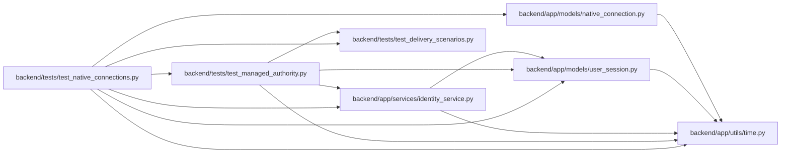

# test_native_connections Module

**Path:** `backend/tests/test_native_connections.py`

## Description

Browser-approved native sessions preserve proof, identity and revocation.

## Imports

| Source | Symbols |
|--------|---------|
| `app.models.native_connection` | `NativeConnection` |
| `app.models.user_session` | `UserSession` |
| `app.services.identity_service` | `digest` |
| `app.utils.time` | `utc_now` |
| `asyncio` | `asyncio` |
| `base64` | `base64` |
| `datetime` | `timedelta` |
| `hashlib` | `hashlib` |
| `pytest` | `pytest` |
| `sqlalchemy` | `select` |
| `tests.test_delivery_scenarios` | `delivery_store` |
| `tests.test_managed_authority` | `client`, `managed_store` |

## Local dependency map

<!-- Auto-generated local dependency summary. Do not edit by hand. -->

### Internal neighbors

| Direction | Module |
|---|---|
| Outbound | [native_connection](../modules/native_connection.md) |
| Outbound | [user_session](../modules/user_session.md) |
| Outbound | [identity_service](../modules/identity_service.md) |
| Outbound | [time](../modules/time.md) |
| Outbound | [test_delivery_scenarios](../modules/test_delivery_scenarios.md) |
| Outbound | [test_managed_authority](../modules/test_managed_authority.md) |

### External packages

| Language | Used packages | Undeclared packages |
|---|---:|---:|
| python | 2 | 1 |

## Functions

| Function | Signature | Decorators | Description |
|----------|-----------|------------|-------------|
| `start_connection` | *(async)* `()` | — | — |
| `approve` | *(async)* `(connection, token, csrf = 'csrf-0')` | — | — |
| `exchange` | *(async)* `(connection, verifier = VERIFIER)` | — | — |
| `test_native_handoff_requires_browser_consent_and_exact_proof` | *(async)* `(managed_store)` | — | — |
| `test_native_approval_cannot_be_switched_to_another_account` | *(async)* `(managed_store)` | — | — |
| `test_native_handoff_rechecks_approving_session_revocation` | *(async)* `(managed_store)` | — | — |
| `test_native_expiration_and_input_bounds` | *(async)* `(managed_store)` | — | — |
| `test_native_connection_details_require_a_human_session` | *(async)* `(managed_store)` | — | — |
| `test_concurrent_native_exchange_issues_one_session` | *(async)* `(managed_store)` | — | — |
