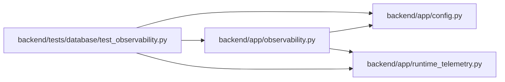

# test_observability Module

**Path:** `backend/tests/database/test_observability.py`

## Description

DBM-OBS-001 readiness, drain, and safe-metrics tests.

## Imports

| Source | Symbols |
|--------|---------|
| `__future__` | `annotations` |
| `app.config` | `get_settings` |
| `app.observability` | `install_database_instrumentation`, `readiness_snapshot` |
| `app.runtime_telemetry` | `MetricRegistry`, `activity` |
| `pathlib` | `Path` |
| `pytest` | `pytest` |
| `sqlalchemy` | `text` |
| `sqlalchemy.exc` | `TimeoutError` |
| `sqlalchemy.ext.asyncio` | `AsyncEngine`, `AsyncSession`, `async_sessionmaker` |
| `typing` | `Any` |

## Local dependency map

<!-- Auto-generated local dependency summary. Do not edit by hand. -->

### Internal neighbors

| Direction | Module |
|---|---|
| Outbound | [config](../modules/config.md) |
| Outbound | [observability](../modules/observability.md) |
| Outbound | [runtime_telemetry](../modules/runtime_telemetry.md) |

### External packages

| Language | Used packages | Undeclared packages |
|---|---:|---:|
| python | 2 | 1 |

## Classes

| Class | Line | Bases | Description |
|-------|------|-------|-------------|
| [FailingSession](../entities/FailingSession.md) | 139 | — | — |
| [FailingSessionContext](../entities/FailingSessionContext.md) | 147 | — | — |

## Functions

| Function | Signature | Decorators | Description |
|----------|-----------|------------|-------------|
| `clear_settings_cache` | `() -> None` | `@pytest.fixture(autouse=True)` | — |
| `test_stale_schema_is_live_but_not_database_ready` | *(async)* `(db_session_factory: async_sessionmaker[AsyncSession], monkeypatch: pytest.MonkeyPatch) -> None` | `@pytest.mark.sqlite`, `@pytest.mark.asyncio` | — |
| `test_current_schema_exports_queue_process_and_drain_evidence` | *(async)* `(db_session_factory: async_sessionmaker[AsyncSession], monkeypatch: pytest.MonkeyPatch) -> None` | `@pytest.mark.sqlite`, `@pytest.mark.asyncio` | — |
| `test_incomplete_migration_gate_keeps_current_schema_unready` | *(async)* `(db_session_factory: async_sessionmaker[AsyncSession], monkeypatch: pytest.MonkeyPatch) -> None` | `@pytest.mark.sqlite`, `@pytest.mark.asyncio` | — |
| `test_pool_timeout_removes_only_the_unready_replica` | *(async)* `(monkeypatch: pytest.MonkeyPatch) -> None` | `@pytest.mark.asyncio` | — |
| `test_metrics_registry_contains_only_aggregate_safe_values` | `() -> None` | — | — |
| `test_production_gateway_exports_attempts_and_routes_public_synthetic_probe` | `() -> None` | — | — |
| `test_active_transaction_gauge_returns_to_zero` | *(async)* `(sqlite_engine: AsyncEngine) -> None` | `@pytest.mark.sqlite`, `@pytest.mark.asyncio` | — |
