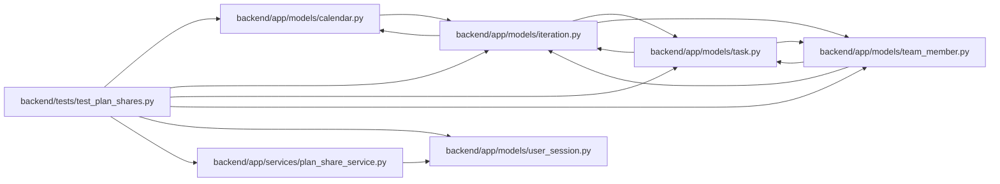

# test_plan_shares Module

**Path:** `backend/tests/test_plan_shares.py`

## Description

Plan-share ownership and immutable snapshot behavior.

## Imports

| Source | Symbols |
|--------|---------|
| `app.models.calendar` | `Calendar` |
| `app.models.iteration` | `Iteration` |
| `app.models.task` | `Task` |
| `app.models.team_member` | `TeamMember` |
| `app.models.user_session` | `UserSession` |
| `app.services.plan_share_service` | `PlanShareService` |
| `datetime` | `date` |
| `pytest` | `pytest` |
| `sqlalchemy.ext.asyncio` | `AsyncSession` |

## Local dependency map

<!-- Auto-generated local dependency summary. Do not edit by hand. -->

### Internal neighbors

| Direction | Module |
|---|---|
| Outbound | [models_calendar](../modules/models_calendar.md) |
| Outbound | [models_iteration](../modules/models_iteration.md) |
| Outbound | [models_task](../modules/models_task.md) |
| Outbound | [team_member](../modules/team_member.md) |
| Outbound | [user_session](../modules/user_session.md) |
| Outbound | [plan_share_service](../modules/plan_share_service.md) |

### External packages

| Language | Used packages | Undeclared packages |
|---|---:|---:|
| python | 2 | 1 |

## Functions

| Function | Signature | Decorators | Description |
|----------|-----------|------------|-------------|
| `test_plan_share_replaces_owner_link_with_new_immutable_snapshot` | *(async)* `(db_session: AsyncSession) -> None` | `@pytest.mark.asyncio` | — |
| `test_plan_share_missing_iteration_returns_none` | *(async)* `(db_session: AsyncSession) -> None` | `@pytest.mark.asyncio` | — |
