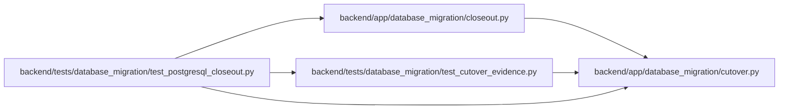

# test_postgresql_closeout Module

**Path:** `backend/tests/database_migration/test_postgresql_closeout.py`

## Description

Contracts for DBM-DOC-002 publication and DBM-CLOSE-001 decisions.

## Imports

| Source | Symbols |
|--------|---------|
| `__future__` | `annotations` |
| `app.database_migration.closeout` | `AUDIT_CHECK_IDS`, `AVAILABILITY_OBJECTIVE_PERCENT`, `CAPACITY_WORDING`, `CLOSEOUT_INPUT_ATTESTATION`, `DBM_TASK_IDS`, `RELEASE_GATE_IDS`, `CloseoutEvidenceError`, `_validate_availability`, `finalize_closeout`, `publish_postcutover_release`, `render_release_notes`, `verify_closeout_report` |
| `app.database_migration.cutover` | `authorize_production`, `finalize_production`, `finalize_rehearsal_series`, `seal_execution` |
| `datetime` | `UTC`, `datetime`, `timedelta` |
| `json` | `json` |
| `jsonschema` | `Draft202012Validator`, `FormatChecker` |
| `pathlib` | `Path` |
| `pytest` | `pytest` |
| `tests.database_migration.test_cutover_evidence` | `_execution`, `_finalize_one_rehearsal`, `_key_pair`, `_operators`, `_release_reference`, `_target`, `_timestamp`, `_trusted_inputs`, `_write_raw` |
| `tomllib` | `tomllib` |

## Local dependency map

<!-- Auto-generated local dependency summary. Do not edit by hand. -->

### Internal neighbors

| Direction | Module |
|---|---|
| Outbound | [database_migration_closeout](../modules/database_migration_closeout.md) |
| Outbound | [database_migration_cutover](../modules/database_migration_cutover.md) |
| Outbound | [test_cutover_evidence](../modules/test_cutover_evidence.md) |

### External packages

| Language | Used packages | Undeclared packages |
|---|---:|---:|
| python | 2 | 2 |

## Functions

| Function | Signature | Decorators | Description |
|----------|-----------|------------|-------------|
| `_production_chain` | `(tmp_path: Path) -> tuple[dict, dict]` | — | — |
| `_publication` | `(tmp_path: Path, trusted: dict, production: dict) -> tuple[dict, Path, Path]` | — | — |
| `_complete_closeout` | `(trusted: dict, production: dict, publication: dict) -> dict` | — | — |
| `_not_started_closeout` | `() -> dict` | — | — |
| `_write_json` | `(path: Path, payload: dict) -> None` | — | — |
| `test_postcutover_publication_and_ship_decision_are_bound_to_production` | `(tmp_path: Path) -> None` | — | — |
| `test_missing_production_evidence_is_signed_no_ship` | `(tmp_path: Path) -> None` | — | — |
| `test_availability_claim_and_external_evidence_cannot_be_fabricated` | `(tmp_path: Path) -> None` | — | — |
| `test_closeout_entrypoint_is_packaged` | `() -> None` | — | — |
| `test_postcutover_input_schemas_match_runtime_examples` | `() -> None` | — | — |
| `test_availability_objective_requires_complete_thirty_day_denominator` | `() -> None` | — | — |
