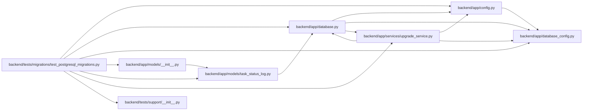

# test_postgresql_migrations Module

**Path:** `backend/tests/migrations/test_postgresql_migrations.py`

## Description

Real PostgreSQL migration, locking, and schema contract tests.

## Imports

| Source | Symbols |
|--------|---------|
| `__future__` | `annotations` |
| `alembic` | `command` |
| `app` | `models` |
| `app.config` | `get_settings` |
| `app.database` | `Base` |
| `app.database_config` | `parse_database_configuration` |
| `app.models.task_status_log` | `TaskStatusLog` |
| `app.services.upgrade_service` | `LEGACY_BASELINE_REVISION`, `UpgradeError`, `alembic_config`, `bootstrap_database_schema`, `head_revision`, `inspect_database`, `run_alembic_upgrade` |
| `concurrent.futures` | `ThreadPoolExecutor` |
| `datetime` | `UTC` |
| `importlib` | `importlib` |
| `json` | `json` |
| `os` | `os` |
| `pathlib` | `Path` |
| `pytest` | `pytest` |
| `sqlalchemy` | `create_engine`, `inspect`, `select`, `text` |
| `sqlalchemy.exc` | `DBAPIError` |
| `sqlalchemy.ext.asyncio` | `create_async_engine` |
| `sqlalchemy.orm` | `Session` |
| `sqlalchemy.pool` | `NullPool` |
| `tests.support` | `cross_dialect_schema_diff`, `schema_snapshot` |
| `threading` | `threading` |

## Local dependency map

<!-- Auto-generated local dependency summary. Do not edit by hand. -->

### Internal neighbors

| Direction | Module |
|---|---|
| Outbound | [config](../modules/config.md) |
| Outbound | [app_database](../modules/app_database.md) |
| Outbound | [database_config](../modules/database_config.md) |
| Outbound | [models___init__](../modules/models___init__.md) |
| Outbound | [task_status_log](../modules/task_status_log.md) |
| Outbound | [upgrade_service](../modules/upgrade_service.md) |
| Outbound | [support___init__](../modules/support___init__.md) |

### External packages

| Language | Used packages | Undeclared packages |
|---|---:|---:|
| python | 3 | 1 |

## Functions

| Function | Signature | Decorators | Description |
|----------|-----------|------------|-------------|
| `sync_engine` | `(database_url: str)` | — | — |
| `seed_postgresql_legacy_baseline` | `(database_url: str) -> None` | — | — |
| `test_fresh_postgresql_schema_only_bootstrap` | `(postgres_database, configure_database) -> None` | `@pytest.mark.postgresql`, `@pytest.mark.integration`, `@pytest.mark.allow_network` | — |
| `test_runtime_role_cannot_create_schema_objects_or_roles` | `(postgres_database, configure_database) -> None` | `@pytest.mark.postgresql`, `@pytest.mark.integration`, `@pytest.mark.allow_network` | — |
| `test_postgresql_legacy_to_head_repairs_utc_nullability_and_sequences` | `(postgres_database, configure_database) -> None` | `@pytest.mark.postgresql`, `@pytest.mark.integration`, `@pytest.mark.allow_network` | — |
| `test_nonempty_postgresql_upgrade_requires_external_backup_gate` | `(postgres_database, configure_database) -> None` | `@pytest.mark.postgresql`, `@pytest.mark.integration`, `@pytest.mark.allow_network` | — |
| `test_concurrent_postgresql_migration_runners_serialize` | `(postgres_database, configure_database) -> None` | `@pytest.mark.postgresql`, `@pytest.mark.integration`, `@pytest.mark.allow_network` | — |
| `test_postgresql_utc_types_partial_indexes_and_sequence_ownership` | `(postgres_database, configure_database) -> None` | `@pytest.mark.postgresql`, `@pytest.mark.integration`, `@pytest.mark.allow_network` | — |
| `test_sync_postgresql_driver_select_one` | `(postgres_database, configure_database) -> None` | `@pytest.mark.postgresql`, `@pytest.mark.integration`, `@pytest.mark.allow_network` | — |
| `test_async_postgresql_driver_select_one` | *(async)* `(postgres_database, configure_database) -> None` | `@pytest.mark.postgresql`, `@pytest.mark.integration`, `@pytest.mark.allow_network`, `@pytest.mark.asyncio` | — |
| `test_cross_dialect_schema_diff_is_machine_readable` | `(postgres_database, configure_database, tmp_path: Path) -> None` | `@pytest.mark.postgresql`, `@pytest.mark.integration`, `@pytest.mark.allow_network` | — |
